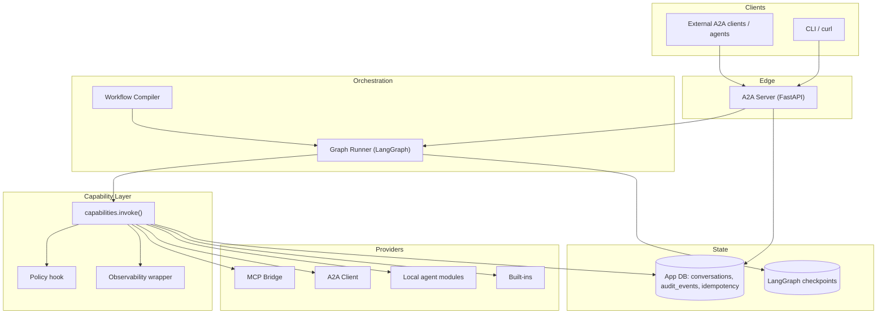
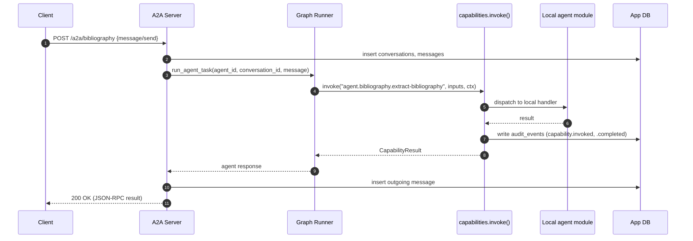
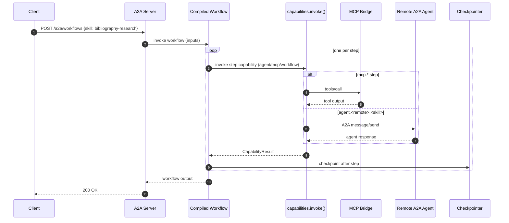
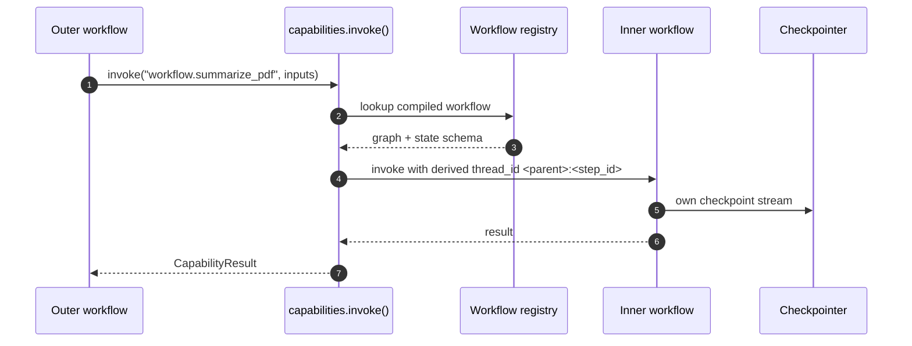

# 00 — System Overview

## 1. Purpose

Give a complete mental model of the system on one page (and then a few more pages of detail). After reading this, you should know **what the layers are**, **how a request flows through them**, and **where to look** for any deeper concern.

## 2. Concepts

- **Capability** — anything callable through the runtime. Identified by a URI: `mcp.*`, `agent.*`, `workflow.*`, or `builtin.*`. There is **one** invocation function, `capabilities.invoke(uri, inputs, ctx)`.
- **Agent** — a domain module (e.g., `bibliography_agent`) exposing one or more **skills**. Agents may be local Python modules or remote A2A endpoints.
- **MCP server** — an out-of-process tool provider managed by the runtime via stdio, HTTP, or SSE. Each discovered tool becomes a capability automatically.
- **Workflow** — a declarative DAG of steps over capabilities, written in [`workflows.yaml`](../../workflows.yaml). Compiled to LangGraph at boot and exposed as A2A skills.
- **Runtime** — the shared infrastructure (A2A server, capability registry, MCP bridge, A2A client, workflow compiler, storage, observability, policy).

## 3. Contract — the layer cake



Layer responsibilities are non-overlapping:

| Layer | Lives in | Decides | Does *not* |
|-------|----------|---------|-----------|
| Edge | `runtime/a2a_server.py` | auth, request shape, conversation ID | dispatch logic, business rules |
| Orchestration | `runtime/graph_runner.py`, `runtime/workflows/` | execution order, retries, state | how to invoke individual capabilities |
| Capability | `runtime/capabilities.py` | URI resolution, policy, audit, tracing | how a tool/skill is implemented |
| Providers | `runtime/mcp_bridge.py`, `runtime/a2a_client.py`, `src/agent_stack/agents/*` | transport, schema validation | retries, audit (handled above) |
| State | `runtime/storage.py`, `runtime/checkpointer.py` | persistence and durability | business logic |

## 4. Diagrams — request lifecycles

### 4.1 Direct A2A `message/send` to a local agent skill



### 4.2 Workflow execution



### 4.3 Sub-workflow call



## 5. Failure modes (high-level)

| Failure | Where it surfaces | Handling |
|---------|-------------------|----------|
| MCP server crash | `capability.upstream_error` from `mcp_bridge` | Supervisor restarts with backoff; audit event `mcp.server.crashed`. |
| Remote agent unreachable | `capability.unavailable` from `a2a_client` | Circuit breaker opens after N failures; visible at `/admin/remotes`. |
| Workflow input validation fails | `capability.input_validation_failed` at workflow entry | Workflow does not start; audit event written. |
| Expression evaluation error | `capability.execution_error` (`details.step_id`, `details.expression`) | Honors `on_error` directive; otherwise step fails. |
| Policy denial | `capability.denied_by_policy` | `policy.denied` audit event. |

## 6. Extension points

- **New MCP server**: append to [`mcp_servers.yaml`](../../mcp_servers.yaml). The bridge discovers tools and they appear as `mcp.<server>.<tool>` capabilities. See [12-extension-cookbook](12-extension-cookbook.md#add-a-new-mcp-server).
- **New workflow**: append to [`workflows.yaml`](../../workflows.yaml). The compiler builds a LangGraph; if `exposed_as_skill` is set, it becomes externally callable. See [12-extension-cookbook](12-extension-cookbook.md#add-a-new-workflow).
- **New agent skill**: add a method to the agent module and a `skills:` entry in [`agents.yaml`](../../agents.yaml). Regenerate the agent card. See [12-extension-cookbook](12-extension-cookbook.md#add-a-new-agent).
- **New built-in step kind**: add to `runtime/workflows/steps.py` and update [03-workflows](03-workflows.md) closed-set table.

## 7. Worked example — composing without writing Python

A workflow that combines a local agent skill with an MCP tool and a built-in:

```yaml file=workflows.yaml.example
schema_version: 1
workflows:
  bibliography_research:
    version: 0.1.0
    name: Bibliography Research
    description: Extract bibliography, resolve OA metadata, fetch PDFs.
    exposed_as_skill:
      id: bibliography-research
      tags: [research, bibliography, workflow]
    inputs:
      pdf_path: { type: string, required: true }
    steps:
      - id: extract
        call: agent.bibliography.extract-bibliography
        with: { input: "{{ inputs.pdf_path }}" }
        output: references
      - id: resolve
        call: agent.bibliography.resolve-open-access-pdfs
        with: { references: "{{ steps.extract.references }}" }
        output: oa_candidates
      - id: approve
        type: human_approval
        when: "{{ len(steps.resolve.oa_candidates) > 5 }}"
        message: "About to download {{ len(steps.resolve.oa_candidates) }} PDFs. Approve?"
      - id: download
        type: parallel
        for_each: "{{ steps.resolve.oa_candidates }}"
        as: candidate
        call: mcp.filesystem-safe.download_url
        with:
          url: "{{ candidate.pdf_url }}"
          dest: "./artifacts/{{ candidate.id }}.pdf"
        output: downloads
    output:
      references: "{{ steps.extract.references }}"
      downloads: "{{ steps.download.downloads }}"
```

This file is the same one referenced by [`docs/build-plan.md`](../build-plan.md). The doc-drift test asserts they match.

## 8. Design principles

1. **One invocation seam.** All cross-boundary calls go through `capabilities.invoke`. Auth, policy, audit, and tracing live there once, not in every handler.
2. **Configuration over code.** New workflows ship as YAML, not modules. Python is the escape hatch, not the default.
3. **Closed sets where possible.** Step kinds, error codes, and audit event types are explicit enums — they are part of the contract.
4. **Secrets via environment only.** No secrets in YAML, generated cards, or `AGENTS.md`. Validated by the security test suite.
5. **Docs are checked.** Every fenced block tagged `file=<path>` must equal the real file. Drift fails CI.
6. **Conservative defaults.** Localhost binding, dev auth opt-in, OpenClaw/NemoClaw disabled until verified.

## 9. Cross-references

- [01-config-and-registries](01-config-and-registries.md) — the three YAML files in detail.
- [02-capabilities](02-capabilities.md) — invocation envelope and error taxonomy.
- [03-workflows](03-workflows.md) — workflow YAML grammar and step kinds.
- [04-mcp-integration](04-mcp-integration.md) — MCP bridge lifecycle.
- [05-a2a](05-a2a.md) — A2A inbound + outbound, multi-agent.
- [06-runtime-and-langgraph](06-runtime-and-langgraph.md) — graph runner and checkpointer.
- [07-storage-and-audit](07-storage-and-audit.md) — what lives in app tables vs. LangGraph tables.
- [08-security-and-policy](08-security-and-policy.md) — auth, allow/deny, secrets.
- [11-observability](11-observability.md) — log schema, OTEL, metrics, audit-event taxonomy.
- [13-traceability](13-traceability.md) — end-to-end trace propagation and backend operations.
- [12-extension-cookbook](12-extension-cookbook.md) — recipes for adding new things.
