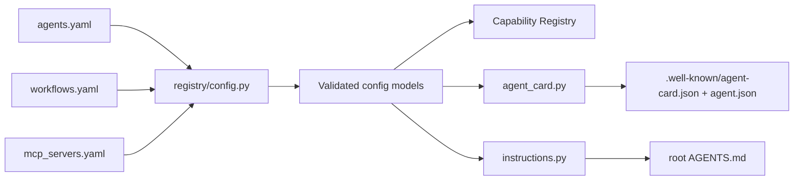

# 01 — Config and Registries

## 1. Purpose

Define the three registry files that drive the runtime: [`agents.yaml`](../../agents.yaml), [`workflows.yaml`](../../workflows.yaml), and [`mcp_servers.yaml`](../../mcp_servers.yaml). Specify their schemas, loader behavior, generation rules, and migration policy.

These three files are the **only sources of truth** for static configuration. Generated artifacts (root `AGENTS.md`, `.well-known/agent-card.json`, `.well-known/agent.json`) are produced from them.

## 2. Concepts

- **Registry** — a YAML file whose Pydantic model is the authoritative schema for one kind of static config.
- **`schema_version`** — every registry file's top-level integer (or semver string). The loader rejects unknown versions and points at the migration table below.
- **Generation** — root `AGENTS.md` and agent card files are *outputs*, not inputs. Editing them is a violation; the build will overwrite them.
- **Secrets boundary** — registries never hold credentials. Secrets are referenced by env var name only (e.g., `token_env: EXTERNAL_RESEARCHER_TOKEN`).

## 3. Contract — schemas

### 3.1 `agents.yaml`

```yaml file=agents.yaml
schema_version: 1
runtime:
  default_host: 127.0.0.1
  default_port: 8080
  default_base_url: http://127.0.0.1:8080
  default_a2a_prefix: /a2a
  generated_card_paths:
    - .well-known/agent-card.json
    - .well-known/agent.json

agents:
  generic:
    id: generic
    name: local-generic-agent
    display_name: Local Generic Agent
    version: 0.1.0
    description: >
      A minimal pass-through agent used as a fallback or for ad-hoc skills.
    owner:
      organization: local-dev
      contact: local
    runtime:
      kind: local
      module: agent_stack.agents.generic_agent.graph
      factory: build_graph
      state_schema: agent_stack.agents.generic_agent.state.GenericState
    server:
      base_url: http://127.0.0.1:8080
      a2a_endpoint: /a2a/generic
    auth:
      mode: local_bearer
      env_token_name: LOCAL_AGENT_TOKEN
      allow_none_for_dev: true
    capabilities:
      streaming: false
      push_notifications: false
      state_transition_history: true
      file_upload: false
      artifacts: false
    skills:
      - id: echo
        name: Echo
        description: Echo the user message back.
        tags: [debug]
        input_modes: [text/plain]
        output_modes: [text/plain]
    behavior:
      instruction_file: src/agent_stack/agents/generic_agent/AGENTS.md

  bibliography:
    id: bibliography
    name: local-bibliography-agent
    display_name: Local Bibliography Agent
    version: 0.1.0
    description: >
      Extracts bibliographies, resolves scholarly metadata, and finds
      legally available open-access PDFs.
    owner:
      organization: local-dev
      contact: local
    runtime:
      kind: local
      module: agent_stack.agents.bibliography_agent.graph
      factory: build_graph
      state_schema: agent_stack.agents.bibliography_agent.state.BibliographyState
    server:
      base_url: http://127.0.0.1:8080
      a2a_endpoint: /a2a/bibliography
    auth:
      mode: local_bearer
      env_token_name: LOCAL_AGENT_TOKEN
      allow_none_for_dev: true
    capabilities:
      streaming: true
      push_notifications: false
      state_transition_history: true
      file_upload: true
      artifacts: true
    skills:
      - id: extract-bibliography
        name: Extract Bibliography
        description: Extract bibliography entries from PDF, BibTeX, RIS, or Markdown.
        tags: [research, bibliography, bibtex, pdf]
        input_modes: [text/plain, application/pdf, text/markdown]
        output_modes: [application/json, text/markdown]
      - id: resolve-open-access-pdfs
        name: Resolve Open Access PDFs
        description: Resolve legal open-access PDFs using arXiv, Unpaywall, OpenAlex, Crossref.
        tags: [open-access, pdf, scholarly-metadata]
        input_modes: [application/json, text/plain]
        output_modes: [application/json]
      - id: summarize-paper
        name: Summarize Paper
        description: Summarize a paper with citation, abstract, claims, method, limitations.
        tags: [summary, paper, research]
        input_modes: [application/pdf, text/plain]
        output_modes: [text/markdown, application/json]
    behavior:
      instruction_file: src/agent_stack/agents/bibliography_agent/AGENTS.md
      rules:
        - Never download copyrighted PDFs from unauthorized mirrors.
        - Prefer official publisher pages, arXiv, institutional repositories, and Unpaywall.
        - Keep an audit log of external URLs accessed.
        - Ask for confirmation before deleting files.
    policy:
      filesystem:
        allowed_roots: [./data, ./artifacts]
        deny_patterns: [~/.ssh, ~/.aws, ~/.config/gcloud]
      network:
        allow_domains:
          - api.crossref.org
          - api.openalex.org
          - api.semanticscholar.org
          - api.unpaywall.org
          - arxiv.org
          - export.arxiv.org

  external_researcher:
    id: external_researcher
    name: external-researcher
    version: 0.1.0
    description: Example remote A2A agent reachable over the network.
    runtime:
      kind: remote
      remote:
        base_url: http://10.0.0.5:8080
        a2a_endpoint: /a2a/researcher
        auth:
          mode: bearer
          token_env: EXTERNAL_RESEARCHER_TOKEN
        resilience:
          connect_timeout_seconds: 3
          read_timeout_seconds: 30
          retry: { max_attempts: 3, backoff_seconds: 1.0, jitter: true }
          circuit_breaker: { failure_threshold: 5, reset_seconds: 30 }
    skills:
      - id: literature-search
        name: Literature Search
        description: Search external scholarly indices.
        tags: [research, external]
```

Schema (Pydantic sketch — final lives in `src/agent_stack/registry/schemas.py`):

```python
class RuntimeBlock(BaseModel):
    default_host: str = "127.0.0.1"
    default_port: int = 8080
    default_base_url: AnyHttpUrl
    default_a2a_prefix: str = "/a2a"
    generated_card_paths: list[str]

class AgentRuntimeLocal(BaseModel):
    kind: Literal["local"]
    module: str
    factory: str
    state_schema: str

class RemoteAuth(BaseModel):
    mode: Literal["bearer", "none"]
    token_env: str | None = None

class RemoteResilience(BaseModel):
    connect_timeout_seconds: float = 3
    read_timeout_seconds: float = 30
    retry: dict = Field(default_factory=lambda: {"max_attempts": 3, "backoff_seconds": 1.0, "jitter": True})
    circuit_breaker: dict = Field(default_factory=lambda: {"failure_threshold": 5, "reset_seconds": 30})

class AgentRuntimeRemote(BaseModel):
    kind: Literal["remote"]
    remote: RemoteSpec   # base_url + a2a_endpoint + auth + resilience

AgentRuntime = Annotated[Union[AgentRuntimeLocal, AgentRuntimeRemote], Field(discriminator="kind")]

class Skill(BaseModel):
    id: str
    name: str
    description: str
    tags: list[str] = []
    input_modes: list[str] = []
    output_modes: list[str] = []

class Agent(BaseModel):
    id: str
    name: str
    display_name: str | None = None
    version: str
    description: str
    owner: Owner | None = None
    runtime: AgentRuntime
    server: ServerBlock | None = None
    auth: AuthBlock | None = None
    capabilities: AgentCapabilities | None = None
    skills: list[Skill]
    behavior: BehaviorBlock | None = None
    policy: PolicyBlock | None = None

class AgentsYaml(BaseModel):
    schema_version: Literal[1]
    runtime: RuntimeBlock
    agents: dict[str, Agent]
```

### 3.2 `workflows.yaml`

The full grammar is documented in [03-workflows](03-workflows.md). The top-level shape:

```yaml file=workflows.yaml
schema_version: 1
workflows:
  bibliography_research:
    version: 0.1.0
    name: Bibliography Research
    description: Extract bibliography, resolve OA metadata, fetch PDFs.
    exposed_as_skill:
      id: bibliography-research
      tags: [research, bibliography, workflow]
    inputs:
      pdf_path: { type: string, required: true }
    steps:
      - id: extract
        call: agent.bibliography.extract-bibliography
        with: { input: "{{ inputs.pdf_path }}" }
        output: references
      - id: resolve
        call: agent.bibliography.resolve-open-access-pdfs
        with: { references: "{{ steps.extract.references }}" }
        output: oa_candidates
      - id: approve
        type: human_approval
        when: "{{ len(steps.resolve.oa_candidates) > 5 }}"
        message: "About to download {{ len(steps.resolve.oa_candidates) }} PDFs. Approve?"
      - id: download
        type: parallel
        for_each: "{{ steps.resolve.oa_candidates }}"
        as: candidate
        call: mcp.filesystem-safe.download_url
        with:
          url: "{{ candidate.pdf_url }}"
          dest: "./artifacts/{{ candidate.id }}.pdf"
        output: downloads
    output:
      references: "{{ steps.extract.references }}"
      downloads: "{{ steps.download.downloads }}"
```

### 3.3 `mcp_servers.yaml`

The full grammar and bridge behavior is documented in [04-mcp-integration](04-mcp-integration.md):

```yaml file=mcp_servers.yaml
schema_version: 1
servers:
  filesystem-safe:
    id: filesystem-safe
    transport: stdio
    command: python
    args: ["-m", "agent_stack.tools.filesystem_safe"]
    cwd: .
    env_passthrough: [PATH, HOME]
    env:
      FS_SAFE_ROOT: "./data"
    autostart: true
    health:
      ready_timeout_seconds: 10
      probe: tools/list
    capabilities_filter:
      allow_tools: ["read_file", "write_file", "download_url"]
      deny_tools: []
    policy:
      max_concurrent_calls: 4
      per_call_timeout_seconds: 30
      retry: { max_attempts: 2, backoff_seconds: 1.5 }
  fetch:
    id: fetch
    transport: http
    url: http://127.0.0.1:9101/mcp
    headers_env:
      Authorization: FETCH_MCP_BEARER
    autostart: false
```

## 4. Diagrams — load and generate



Loader precedence at startup:

1. Read all three YAML files; reject if any `schema_version` is unknown.
2. Cross-validate:
   - Every workflow step `call: agent.<id>.<skill>` must resolve to an `id`/`skill` combination in `agents.yaml`.
   - Every workflow step `call: mcp.<server>.<tool>` is **not** validated at load time (tools are discovered at runtime by the bridge); validity is checked when the bridge connects.
   - Every workflow step `call: workflow.<id>` must resolve to a workflow defined in `workflows.yaml`.
3. Run `runtime/workflows/compiler.py` to compile each workflow; cache results in memory.
4. Run generators if `--generate` is passed (or if invoked via `scripts/generate_agent_artifacts.py`).

## 5. Failure modes

| Condition | Where | Behavior |
|-----------|-------|----------|
| Unknown `schema_version` | loader | Hard fail with a pointer to the migration table (§7). |
| Missing required field | Pydantic | Hard fail with field path. |
| `call: agent.X.Y` references unknown agent or skill | cross-validation | Hard fail at startup with the workflow id and step id. |
| `call: workflow.X` references unknown workflow | cross-validation | Hard fail at startup. |
| Secret-looking key in any registry (`token`, `secret`, `password`, `api_key`, ...) | security test (`tests/security/test_secret_leak.py`) | Test failure; CI blocks merge. |
| Two agents share an `a2a_endpoint` | loader | Hard fail. |

## 6. Extension points

- **New agent:** add a key under `agents:` in `agents.yaml`, point `runtime.module` and `runtime.factory` at your new Python module, regenerate artifacts.
- **New remote agent:** as above but with `runtime.kind: remote` and a `remote:` block including `auth` and `resilience`.
- **New MCP server:** add a key under `servers:` in `mcp_servers.yaml`.
- **New workflow:** add a key under `workflows:` in `workflows.yaml`.

See [12-extension-cookbook](12-extension-cookbook.md) for the full recipes.

## 7. Schema versioning and migrations

| Registry | Current | Migrations |
|----------|---------|------------|
| `agents.yaml` | 1 | none |
| `workflows.yaml` | 1 | none |
| `mcp_servers.yaml` | 1 | none |

When bumping a `schema_version`:

1. Add a migration script `scripts/migrate_<file>_<from>_to_<to>.py`.
2. Update the row above with a brief note.
3. The loader keeps the prior version's parser for at least one minor release.
4. CI fails any PR that bumps a `schema_version` without a corresponding migration script.

## 8. Worked example — adding a new remote agent

1. Edit `agents.yaml`, add an `agents.<id>` entry with `runtime.kind: remote` and a `remote:` block (see `external_researcher` above).
2. Add `EXTERNAL_RESEARCHER_TOKEN=…` to `.env` (never to YAML).
3. `uv run python scripts/generate_agent_artifacts.py` regenerates `.well-known/*` (the remote agent does **not** appear on the local card; it's listed via `/admin/remotes`).
4. A workflow can now call `agent.external_researcher.<skill_id>`.

## 9. Cross-references

- [00-overview](00-overview.md) — layer cake.
- [02-capabilities](02-capabilities.md) — capability URI resolution against these registries.
- [03-workflows](03-workflows.md) — workflow grammar in depth.
- [04-mcp-integration](04-mcp-integration.md) — MCP bridge behavior.
- [05-a2a](05-a2a.md) — A2A card generation rules.
- [08-security-and-policy](08-security-and-policy.md) — secret handling and policy fields.
