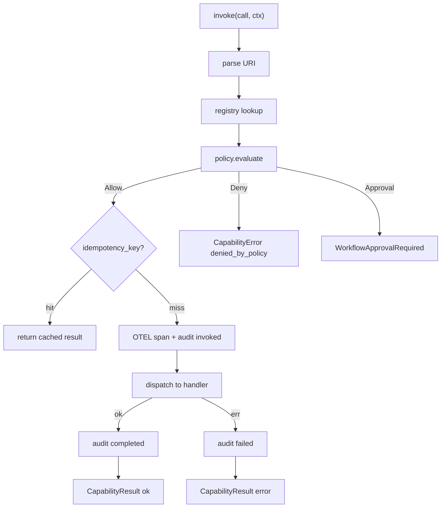
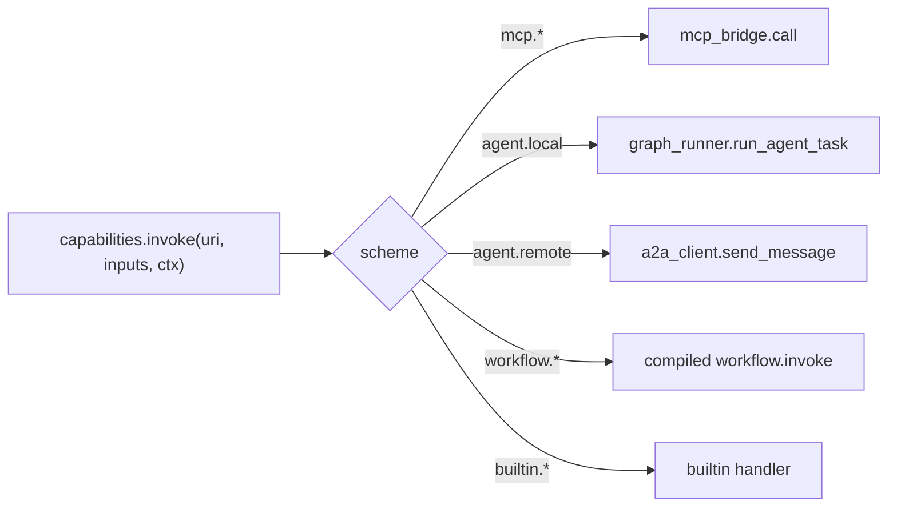

# 02 — Capabilities

## 1. Purpose

Define the **single addressing scheme** and **single invocation function** through which every callable thing in the system is reached: MCP tools, A2A agent skills (local and remote), workflows, and built-ins. This is the seam where auth, policy, audit, tracing, idempotency, cancellation, and streaming are applied — exactly once.

## 2. Concepts

- **Capability** — a uniquely-named thing the runtime can invoke with `inputs` to produce `output`.
- **Capability URI** — the stable name. Four namespaces (closed set): `mcp.*`, `agent.*`, `workflow.*`, `builtin.*`.
- **Capability Registry** — the in-memory catalog of all known capabilities, populated from `agents.yaml`, the MCP bridge's discovery, and the workflow compiler.
- **Invocation envelope** — `CapabilityCall` in, `CapabilityResult` (with optional `CapabilityError`) out. Streaming returns an async iterator of `CapabilityChunk`.
- **Policy hook** — a single function `policy.evaluate(call, ctx)` called before every invocation.

## 3. Contract

### 3.1 URI grammar (BNF)

```
URI         := MCP_URI | AGENT_URI | WORKFLOW_URI | BUILTIN_URI
MCP_URI     := "mcp." SERVER "." (TOOL | RESOURCE_SEL | PROMPT_SEL)
SERVER      := IDENT
TOOL        := IDENT
RESOURCE_SEL := "resource:" URI_PATH
PROMPT_SEL  := "prompt:" IDENT
AGENT_URI   := "agent." AGENT_ID "." SKILL_ID
AGENT_ID    := IDENT
SKILL_ID    := IDENT
WORKFLOW_URI := "workflow." WORKFLOW_ID
WORKFLOW_ID := IDENT
BUILTIN_URI := "builtin." BUILTIN_NAME
BUILTIN_NAME := "branch" | "parallel" | "for_each"
              | "human_approval" | "assign" | "emit_artifact"
IDENT       := [A-Za-z][A-Za-z0-9_-]*
```

URI parsing failures raise `capability.invalid_uri`.

### 3.2 Envelope (Pydantic)

```python
class CapabilityCall(BaseModel):
    uri: str
    inputs: dict[str, Any]
    idempotency_key: str | None = None
    timeout_seconds: float | None = None
    stream: bool = False
    metadata: dict[str, Any] = Field(default_factory=dict)

class CapabilityChunk(BaseModel):
    seq: int
    delta: Any
    done: bool = False

class CapabilityError(BaseModel):
    code: str
    message: str
    retryable: bool
    details: dict[str, Any] = Field(default_factory=dict)

class CapabilityResult(BaseModel):
    uri: str
    ok: bool
    output: Any | None = None
    error: CapabilityError | None = None
    trace_id: str
    span_id: str
    started_at: datetime
    duration_ms: int

class InvocationContext(BaseModel):
    tenant_id: str = "local"
    conversation_id: str
    workflow_id: str | None = None
    workflow_version: str | None = None
    step_id: str | None = None
    cancel_token: Any                  # asyncio.Event
    bearer_token: str | None = None    # carried for outbound A2A; never logged
    trace_id: str
```

### 3.3 Resolution algorithm

```
def invoke(call, ctx):
    1. Parse call.uri -> (scheme, parts); raise capability.invalid_uri on failure.
    2. registry.lookup(scheme, parts):
        a. mcp.<server>.<tool>:
            - require mcp_bridge.servers[server].connected
            - else CapabilityError(capability.unavailable)
            - validate inputs against cached JSON Schema (server, tool)
            - else CapabilityError(capability.input_validation_failed)
        b. agent.<id>.<skill>:
            - if agents[id].runtime.kind == "local": handler = in-process graph runner
            - if agents[id].runtime.kind == "remote": handler = a2a_client
            - else CapabilityError(capability.not_found)
        c. workflow.<id>:
            - require workflows.registry[id]
            - else CapabilityError(capability.not_found)
        d. builtin.<name>:
            - require name in BUILTIN_HANDLERS
    3. decision = policy.evaluate(call, ctx)
        - Allow                -> proceed
        - Deny(reason)         -> CapabilityError(capability.denied_by_policy)
        - Approval(approval_id)-> raise WorkflowApprovalRequired(approval_id)
    4. if call.idempotency_key:
        - hit = audit.idempotency.lookup(ctx.tenant_id, call.uri, call.idempotency_key)
        - if hit and not expired: return hit.result
    5. With OTEL span + structured log:
        - audit "capability.invoked"
        - dispatch with timeout=call.timeout_seconds, cancel_token=ctx.cancel_token
        - on completion: audit "capability.completed"; persist idempotency record
        - on error: audit "capability.failed"; translate exception to CapabilityError code
    6. return CapabilityResult(...)
```

### 3.4 Error taxonomy (stable codes)

| Code | Retryable | When |
|------|-----------|------|
| `capability.invalid_uri` | no | URI grammar fails. |
| `capability.not_found` | no | URI parses but no handler is registered. |
| `capability.unavailable` | yes (transient) | MCP server not connected, remote agent unreachable. |
| `capability.input_validation_failed` | no | Inputs fail JSON Schema or Pydantic validation. |
| `capability.denied_by_policy` | no | Policy hook returned `Deny`. |
| `capability.timeout` | yes | Handler exceeded `timeout_seconds`. |
| `capability.cancelled` | no | Caller signaled `cancel_token`. |
| `capability.streaming_unsupported` | no | `stream=True` but capability is not streaming. |
| `capability.upstream_error` | depends on `retryable` | MCP/HTTP/A2A transport error from a provider. `details.upstream_status` carries the original. |
| `capability.execution_error` | no by default | Uncaught exception inside the handler. |

### 3.5 Streaming contract

- `call.stream=True` returns `AsyncIterator[CapabilityChunk]`.
- The final chunk has `done=True`; consumers must not assume `delta` is non-null in the final chunk.
- Streaming capabilities must still emit a `CapabilityResult` once the stream ends, written to audit/log; this is materialized internally by the registry wrapper.

### 3.6 Cancellation contract

- `ctx.cancel_token` is an `asyncio.Event`. Handlers **must** check it at safe points (between IO, between iterations).
- A handler that returns after `cancel_token.is_set()` will have its result discarded and a `capability.cancelled` error returned.

### 3.7 Idempotency contract

- When `call.idempotency_key` is set, the registry checks `audit.idempotency(tenant_id, capability_uri, idempotency_key)` keyed by sha256 of `(uri, idempotency_key)`.
- Returns the cached `CapabilityResult` within a TTL (default 24h, configurable per capability).
- Idempotency is not applied to streaming calls.

### 3.8 Policy hook signature

```python
class PolicyDecision(BaseModel): ...
class Allow(PolicyDecision): ...
class Deny(PolicyDecision):
    reason: str
class Approval(PolicyDecision):
    approval_id: str
    prompt: str

def evaluate(call: CapabilityCall, ctx: InvocationContext) -> Allow | Deny | Approval: ...
```

The default policy is `Allow` for `agent.<local>.*`, `workflow.*`, and `builtin.*`; `Deny` for any `mcp.*` whose tool is not on its server's `capabilities_filter.allow_tools`; `Deny` for any `agent.<remote>.*` whose remote's circuit breaker is open. See [08-security-and-policy](08-security-and-policy.md) for the policy authoring rules.

## 4. Diagrams

### 4.1 Resolution and dispatch



### 4.2 Where calls go



## 5. Failure modes

| Symptom | Cause | Surfaced as |
|---------|-------|-------------|
| Workflow step hangs | Handler ignores `cancel_token` | After `timeout_seconds`: `capability.timeout`. Add cancel-token checks to the handler. |
| MCP call returns `unavailable` repeatedly | Server crash loop | Inspect `audit_events` for `mcp.server.crashed`; bridge will backoff. |
| Remote agent calls all return `unavailable` | Circuit breaker open | Reset window honored; visible at `/admin/remotes`. |
| Same call charged twice in audit | Caller forgot `idempotency_key` for a non-idempotent provider | Set `idempotency_key`; idempotency is opt-in, by design. |
| Stream consumer blocks forever | Producer crashed mid-stream | Wrapper emits a terminal `CapabilityResult(error=upstream_error)` and closes the iterator. |

## 6. Extension points

- **New capability namespace** (e.g., `tool.<id>`): add a parser branch and a registry implementation. This requires updating the closed-set grammar in §3.1 — treat as a breaking change.
- **New error code**: add to §3.4 and to the corresponding test in `tests/unit/test_capability_registry.py`. Existing codes are stable.
- **Custom policy**: implement `Policy` and wire it in `runtime/capabilities.py`. The default policy is replaceable but the interface is fixed.
- **Streaming wrapper for a non-streaming provider**: implement in the provider, not in the registry. The registry only adapts streams; it does not synthesize them.

## 7. Worked example

Calling an MCP tool with idempotency and a 10s timeout:

```python
result = await capabilities.invoke(
    CapabilityCall(
        uri="mcp.filesystem-safe.download_url",
        inputs={"url": "https://arxiv.org/pdf/2403.00001v1", "dest": "./artifacts/2403.00001.pdf"},
        idempotency_key="arxiv:2403.00001v1",
        timeout_seconds=10.0,
    ),
    ctx=InvocationContext(
        tenant_id="local",
        conversation_id="conv-001",
        workflow_id="bibliography_research",
        workflow_version="0.1.0",
        step_id="download",
        cancel_token=cancel_token,
        trace_id=trace_id,
    ),
)

if not result.ok:
    if result.error.code == "capability.denied_by_policy":
        ...  # surface to the user
    elif result.error.retryable:
        ...  # let the workflow's retry policy kick in
```

## 8. Cross-references

- [00-overview](00-overview.md) — where capabilities sit in the layer cake.
- [01-config-and-registries](01-config-and-registries.md) — what populates the registry.
- [04-mcp-integration](04-mcp-integration.md) — what `mcp.*` resolution does under the hood.
- [05-a2a](05-a2a.md) — what `agent.*` resolution does under the hood (local + remote).
- [08-security-and-policy](08-security-and-policy.md) — policy authoring.
- [11-observability](11-observability.md) — what gets logged and traced per invocation.
