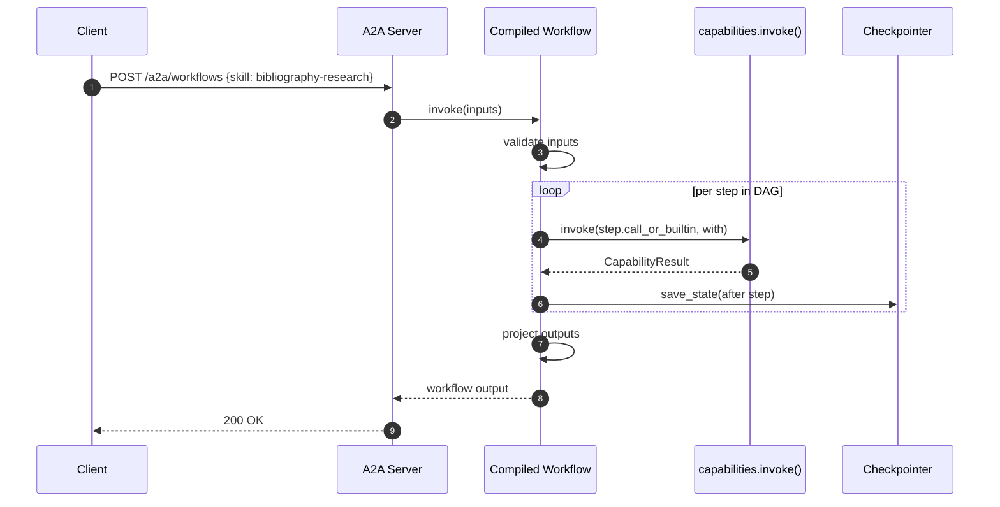

# 03 — Workflows

## 1. Purpose

Specify the declarative workflow language: the YAML grammar, the closed set of step kinds, the expression sandbox, the compilation to LangGraph, sub-workflow semantics, resumability, versioning, and the rules for exposing a workflow as an A2A skill.

Workflows are the **primary** way to compose new behavior from MCP tools and agent skills. Writing Python should be the exception, not the rule.

## 2. Concepts

- **Workflow** — a named, versioned DAG of **steps** with typed `inputs` and `output`. Defined in [`workflows.yaml`](../../workflows.yaml).
- **Step** — a unit of work; one of seven closed kinds (§3.3).
- **Expression** — a sandboxed `{{ ... }}` snippet evaluated against `inputs`, `steps.*`, `ctx.*`.
- **Compilation** — turning the YAML into a LangGraph `StateGraph`. Happens at boot and on hot reload.
- **Workflow as skill** — when `exposed_as_skill` is set, the workflow is reachable at `POST /a2a/workflows` and listed on the synthetic `workflows` agent card.

## 3. Contract

### 3.1 Top-level grammar

```yaml
schema_version: 1
workflows:
  <workflow_id>:
    version: <semver>             # required
    name: <string>                # required
    description: <string>         # optional
    exposed_as_skill:             # optional
      id: <string>                # required if exposed
      tags: [<string>, ...]       # optional
      input_modes: [<mime>, ...]  # optional
      output_modes: [<mime>, ...] # optional
    inputs:                       # optional, default {}
      <name>:
        type: string|integer|number|boolean|object|array|enum
        required: true|false
        default: <value>
        enum: [<value>, ...]      # only when type=enum
        items: { ... }            # only when type=array
        properties: { ... }       # only when type=object
    steps: [ <step>, ... ]        # required, non-empty
    output:                       # optional
      <name>: <expression>
```

### 3.2 Common per-step fields

Every step shares these keys regardless of kind:

| Key | Type | Default | Meaning |
|-----|------|---------|---------|
| `id` | string | required | Unique within the workflow. |
| `description` | string | none | Free-form. |
| `when` | expression | `true` | Skip the step (and its `output` binding) when this evaluates falsy. |
| `timeout_seconds` | number | none | Passed as `CapabilityCall.timeout_seconds` for `call` steps; for parallel/for_each, applies per inner call. |
| `retry` | object | none | `{ max_attempts: int, backoff_seconds: float, on: [<error_code>] }`. Defaults to no retry. `on` defaults to `[capability.timeout, capability.unavailable, capability.upstream_error]`. |
| `on_error` | object | `{ action: fail }` | `{ action: fail|continue|goto, goto?: <step_id>, capture_as?: <name> }`. `capture_as` binds the `CapabilityError` to `steps.<id>.<capture_as>`. |
| `output` | string | none | Bind the step's primary result into `steps.<id>.<name>`. |

### 3.3 Step kinds (closed set)

#### `call`

Invoke a capability.

```yaml
- id: extract
  call: agent.bibliography.extract-bibliography   # any capability URI
  with: { input: "{{ inputs.pdf_path }}" }        # passed as inputs
  idempotency_key: "{{ inputs.pdf_path }}"        # optional
  stream: false                                   # optional
  output: references
```

State transition: `pending -> running -> (succeeded | failed | skipped)`.

#### `assign`

Bind expression results to step output without an external call.

```yaml
- id: derive
  type: assign
  values:
    count: "{{ len(steps.extract.references) }}"
    has_many: "{{ len(steps.extract.references) > 10 }}"
```

The bindings appear as `steps.derive.count` and `steps.derive.has_many`.

#### `branch`

Multi-arm conditional.

```yaml
- id: route
  type: branch
  cases:
    - when: "{{ steps.derive.has_many }}"
      goto: bulk_resolve
    - when: "{{ len(steps.extract.references) > 0 }}"
      goto: resolve
  default: skip_resolve
```

`goto` targets must be step `id`s within the same workflow. Validation rejects cycles unless explicitly marked with `allow_cycle: true` (off by default).

#### `parallel`

Run a fixed list of sub-steps concurrently.

```yaml
- id: enrich
  type: parallel
  branches:
    - id: crossref
      call: mcp.fetch.get_json
      with: { url: "https://api.crossref.org/works/{{ inputs.doi }}" }
    - id: openalex
      call: mcp.fetch.get_json
      with: { url: "https://api.openalex.org/works/doi:{{ inputs.doi }}" }
  output: enrichment  # object keyed by branch id
```

Inner branches are full step definitions and may use any kind except `parallel` or `for_each` (no nested fan-out for v0.1).

#### `for_each`

Fan out over a collection.

```yaml
- id: download
  type: parallel
  for_each: "{{ steps.resolve.oa_candidates }}"
  as: candidate
  max_concurrency: 4                              # optional, default = parallel.policy
  call: mcp.filesystem-safe.download_url
  with:
    url: "{{ candidate.pdf_url }}"
    dest: "./artifacts/{{ candidate.id }}.pdf"
  output: downloads                               # array of results, order preserved
```

`for_each` is syntactic sugar over `parallel` and requires either `call` or `branches` (not both).

#### `human_approval`

Pause the workflow until an operator approves.

```yaml
- id: approve
  type: human_approval
  when: "{{ len(steps.resolve.oa_candidates) > 5 }}"
  message: "Download {{ len(steps.resolve.oa_candidates) }} PDFs?"
  approve_action: "{{ 'goto:download' }}"         # optional; default proceed
  deny_action: "{{ 'on_error.action=fail' }}"     # optional
```

v0.1 implementation: writes a row to `approvals` and returns a `CapabilityResult` with `output={"approval_id": ..., "status": "pending"}`. The workflow halts; resuming hits the post-approval branch via the checkpointer. (Full LangGraph `interrupt/resume` is deferred per [build plan §10](../build-plan.md#10-non-goals-for-v01).)

#### `emit_artifact`

Persist an artifact and record it in `artifacts`.

```yaml
- id: write_summary
  type: emit_artifact
  path: "./artifacts/{{ inputs.doi }}.md"
  mime_type: text/markdown
  content: "{{ steps.summarize.markdown }}"
  metadata: { doi: "{{ inputs.doi }}" }
  output: summary_artifact
```

### 3.4 Typed inputs and outputs

- `inputs` is validated at workflow entry; failures return `capability.input_validation_failed`.
- `output` is a flat object whose values are expressions. After the terminal step, the projector evaluates these against the final state and returns the result.

### 3.5 Expression sandbox

Syntax: `{{ <expr> }}` inside string values, evaluated by `runtime/workflows/expressions.py`.

Whitelisted top-level names:

| Name | Kind | Notes |
|------|------|-------|
| `inputs` | object | The workflow inputs. |
| `steps` | object | Keyed by step id; each step has its declared `output` keys. |
| `ctx` | object | `tenant_id`, `conversation_id`, `workflow_id`, `workflow_version`, `step_id`. |
| `env` | function | `env('FOO', default=None)` — reads from a small allowlisted env subset (configured in `runtime/workflows/expressions.py`). Never reads secret-shaped names. |
| `len` | function | Length of strings/arrays/objects. |
| `now` | function | UTC ISO-8601 string. |
| `uuid` | function | UUIDv4 string. |
| `json` | object | `json.loads`, `json.dumps` only. |
| `default` | function | `default(x, fallback)` — returns `fallback` if `x` is None or missing. |
| `coalesce` | function | First non-None. |
| `regex_match` | function | `regex_match(pattern, value) -> bool`. |

Denied: `eval`, `exec`, attribute access starting with `_`, `__import__`, function definitions, lambdas, comprehensions referencing builtins outside the whitelist. Expression failures raise `capability.execution_error` with `details.step_id` and `details.expression`.

### 3.6 Compilation to LangGraph

```mermaid
flowchart LR
    yaml[workflows.yaml] --> parser[schema.py]
    parser --> ast[Workflow AST]
    ast --> compiler[compiler.py]
    compiler --> state[TypedDict state schema]
    compiler --> nodes[one node per step]
    compiler --> edges[edges + conditional edges]
    nodes --> graph[LangGraph StateGraph]
    edges --> graph
    state --> graph
    graph --> compiled[compiled workflow with checkpointer]
    compiled --> registry[workflows.registry]
```

- One **node** per step. The node calls `capabilities.invoke` (or a built-in handler for non-`call` kinds).
- Control flow kinds (`branch`, `for_each`, `parallel`, `human_approval`) become **conditional edges**.
- The state is a `TypedDict` derived from `inputs.*` and the declared `output` names of each step.
- **Thread ID**: `local:workflow:<workflow_id>:<workflow_version>:<conversation_id>`. Including the version means bumping `version` cleanly starts a fresh checkpoint lineage instead of corrupting old state.

### 3.7 Sub-workflows

A step with `call: workflow.<id>` invokes another workflow. The inner workflow runs on the same checkpointer with thread ID `<parent_thread>:<step_id>`. Inputs/outputs cross via the standard envelope. Recursion is detected at compile time and rejected unless `allow_recursion: true` is set on both sides.

### 3.8 Resumability

- Workflows checkpoint **after every step**.
- On resume, the runner re-hydrates state and restarts at the failed step unless `on_error.action = continue` already advanced past it.
- Resume is implicit when a new `message/send` arrives with the same `conversation_id` and a workflow is in a non-terminal state for that thread.

### 3.9 Versioning

- `version` is **required** and uses semver.
- Bumping the version starts a fresh checkpoint lineage (because version is in the thread ID).
- The compiler stamps `workflow_version` into every `audit_events` row and every OTEL span.

### 3.10 Exposure as A2A skills

When `exposed_as_skill` is set, the runtime:

1. Registers a synthetic agent `workflows` (created on demand; not in `agents.yaml`).
2. Adds an entry to its skills list with the `exposed_as_skill` block.
3. Routes `POST /a2a/workflows` `message/send` with `params.skill == <skill_id>` to the corresponding compiled workflow.
4. Includes the skill in the generated `.well-known/agent-card.json` under the `workflows` agent.

If `exposed_as_skill` is omitted, the workflow is callable only as `workflow.<id>` from another workflow or agent — useful for private sub-workflows.

## 4. Diagrams — workflow execution



## 5. Failure modes

| Symptom | Likely cause | Resolution |
|---------|--------------|------------|
| Workflow fails immediately with `capability.input_validation_failed` | Missing required input, wrong type | Inspect `error.details.path`. |
| `capability.not_found` for `agent.X.Y` at startup | Workflow references a missing agent/skill | Cross-validation fails fast; fix the YAML. |
| `capability.not_found` for `workflow.X` at runtime | Sub-workflow not compiled (e.g., parsing error) | Run `scripts/validate_workflows.py`; check startup logs. |
| Step `assign` evaluates expressions but bindings don't appear downstream | `assign` step had `when` falsy | Audit event shows `skipped`. |
| Parallel branches block each other | `max_concurrency: 1` set | Increase or remove. |
| Workflow restarts at the wrong step after resume | Misuse of `on_error.action = continue` | Continue advances past the failure; if you need to retry, use `retry` instead. |

## 6. Extension points

- **New step kind**: add a class to `runtime/workflows/steps.py` and a Pydantic variant in `runtime/workflows/schema.py`. Update this doc's closed-set table.
- **New expression helper**: add a name to the whitelist in `runtime/workflows/expressions.py`; document in §3.5. Adding unsafe helpers (filesystem, network, dynamic eval) is **prohibited**.
- **Custom output projector**: not supported in v0.1. Use an `assign` step.
- **Per-workflow timeout default**: set `timeout_seconds` on every step explicitly; or add a workflow-level `defaults:` block (planned, not in v0.1).

## 7. Worked example

The canonical example (the same file referenced by [00-overview](00-overview.md#7-worked-example--composing-without-writing-python) and [01-config-and-registries](01-config-and-registries.md#32-workflowsyaml)):

```yaml file=workflows.yaml.example
schema_version: 1
workflows:
  bibliography_research:
    version: 0.1.0
    name: Bibliography Research
    description: Extract bibliography, resolve OA metadata, fetch PDFs.
    exposed_as_skill:
      id: bibliography-research
      tags: [research, bibliography, workflow]
    inputs:
      pdf_path: { type: string, required: true }
    steps:
      - id: extract
        call: agent.bibliography.extract-bibliography
        with: { input: "{{ inputs.pdf_path }}" }
        output: references
      - id: resolve
        call: agent.bibliography.resolve-open-access-pdfs
        with: { references: "{{ steps.extract.references }}" }
        output: oa_candidates
      - id: approve
        type: human_approval
        when: "{{ len(steps.resolve.oa_candidates) > 5 }}"
        message: "About to download {{ len(steps.resolve.oa_candidates) }} PDFs. Approve?"
      - id: download
        type: parallel
        for_each: "{{ steps.resolve.oa_candidates }}"
        as: candidate
        call: mcp.filesystem-safe.download_url
        with:
          url: "{{ candidate.pdf_url }}"
          dest: "./artifacts/{{ candidate.id }}.pdf"
        output: downloads
    output:
      references: "{{ steps.extract.references }}"
      downloads: "{{ steps.download.downloads }}"
```

## 8. Cross-references

- [00-overview](00-overview.md) — workflow lifecycle in the system diagram.
- [01-config-and-registries](01-config-and-registries.md) — top-level loader behavior.
- [02-capabilities](02-capabilities.md) — the invocation envelope used by every step.
- [05-a2a](05-a2a.md) — the synthetic `workflows` agent and routing rules.
- [06-runtime-and-langgraph](06-runtime-and-langgraph.md) — graph runner, checkpointer, thread-ID grammar.
- [11-observability](11-observability.md) — workflow audit events (`workflow.started`, `workflow.step.entered`, etc.).
