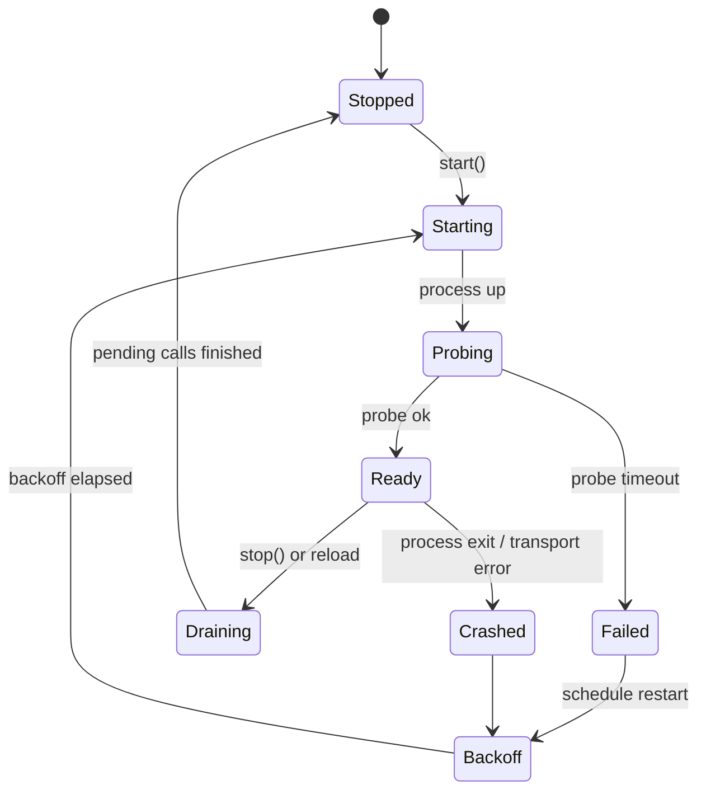
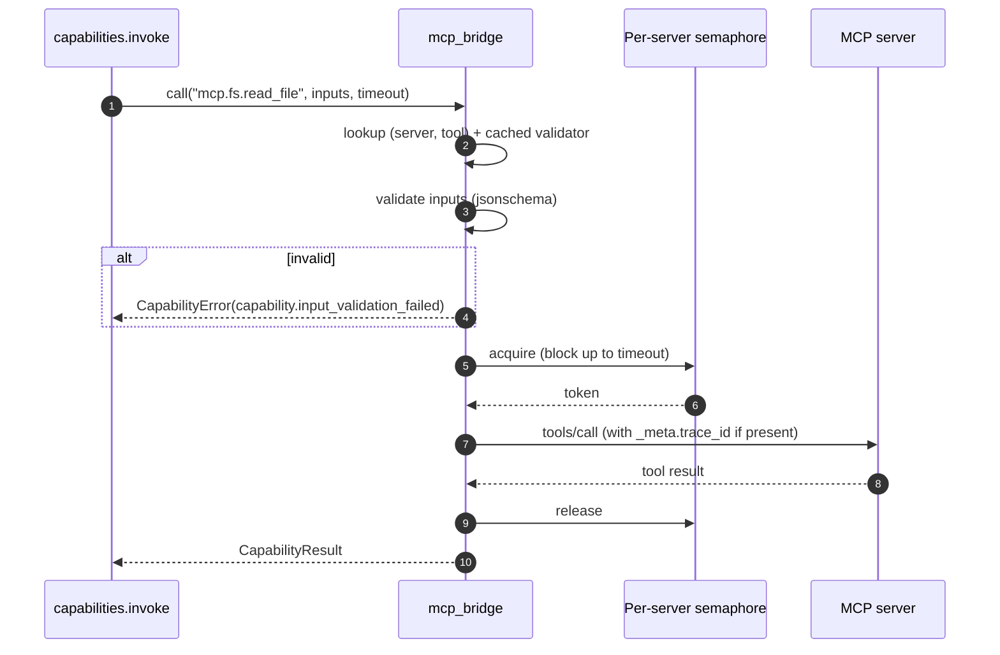
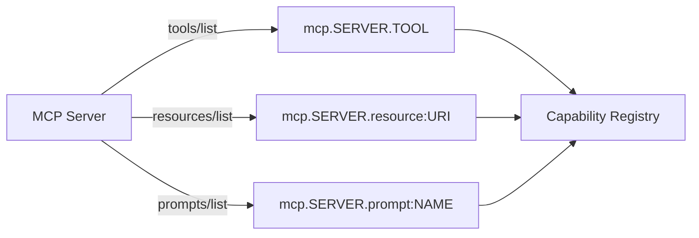

# 04 — MCP Integration

## 1. Purpose

Specify how the runtime manages **MCP (Model Context Protocol) servers**: their lifecycle, transports, discovery, schema cache, invocation, hot reload, and failure handling. The bridge is the substrate that lets every discovered MCP tool, resource, or prompt appear as a first-class capability.

## 2. Concepts

- **MCP server** — an out-of-process provider speaking MCP JSON-RPC. Three transports supported: `stdio`, `http`, `sse`.
- **MCP bridge** (`src/agent_stack/runtime/mcp_bridge.py`) — owns lifecycles, connection pools, schema caches, and the per-server policy. Exposes capabilities to the registry.
- **Discovery** — at startup and after hot reload, the bridge calls `tools/list`, `resources/list`, and `prompts/list` on every connected server and registers each as a capability.
- **Schema cache** — JSON Schemas for tool inputs are cached keyed by `(server_id, content_hash)`. Validators are rebuilt only when the hash changes.

## 3. Contract

### 3.1 Configuration ([`mcp_servers.yaml`](../../mcp_servers.yaml))

```yaml file=mcp_servers.yaml.example
schema_version: 1
servers:
  filesystem-safe:
    id: filesystem-safe
    transport: stdio
    command: python
    args: ["-m", "agent_stack.tools.filesystem_safe"]
    cwd: .
    env_passthrough: [PATH, HOME]
    env:
      FS_SAFE_ROOT: "./data"
    autostart: true
    health:
      ready_timeout_seconds: 10
      probe: tools/list
    capabilities_filter:
      allow_tools: ["read_file", "write_file", "download_url"]
      deny_tools: []
    policy:
      max_concurrent_calls: 4
      per_call_timeout_seconds: 30
      retry: { max_attempts: 2, backoff_seconds: 1.5 }
  fetch:
    id: fetch
    transport: http
    url: http://127.0.0.1:9101/mcp
    headers_env:
      Authorization: FETCH_MCP_BEARER
    autostart: false
```

Field reference:

| Key | Required | Notes |
|-----|----------|-------|
| `transport` | yes | `stdio` \| `http` \| `sse`. |
| `command`, `args`, `cwd` | stdio only | The bridge launches and supervises the subprocess. |
| `url` | http/sse only | Base URL of the MCP endpoint. |
| `env_passthrough` | optional | **Explicit allowlist** of env vars copied into the subprocess. Default: empty (no inheritance). |
| `env` | optional | Inline non-secret env. |
| `headers_env` | http/sse only | Map of `Header-Name -> ENV_VAR_NAME`. Values read at call time, never logged. |
| `autostart` | optional, default `true` | Start at boot. If `false`, the first capability call lazily starts the server. |
| `health.ready_timeout_seconds` | optional, default `10` | Max time to first successful probe. |
| `health.probe` | optional, default `tools/list` | Any MCP method that returns `ok`. |
| `capabilities_filter.allow_tools` / `deny_tools` | optional | Allow-then-deny ordering. Empty `allow_tools` means "allow all discovered". |
| `policy.max_concurrent_calls` | optional, default `4` | Per-server semaphore enforced by the bridge. |
| `policy.per_call_timeout_seconds` | optional, default `30` | Hard cap (clipped further by `CapabilityCall.timeout_seconds`). |
| `policy.retry` | optional | Applied **only** to `capability.upstream_error` and `capability.timeout`. |

### 3.2 Lifecycle (FSM)



Backoff: exponential with cap (1s, 2s, 4s, 8s, 30s ceiling). After 5 consecutive `Failed` transitions the bridge surfaces `mcp.server.unrecoverable` in `audit_events` and stops trying until a hot reload.

### 3.3 Discovery and registration

On every `Ready` transition:

1. Call `tools/list`, `resources/list`, `prompts/list` (best effort; missing methods produce empty lists).
2. For each tool, compute `sha256(canonical_json(schema.inputSchema))` and store under `(server_id, tool_name)`.
3. Register capabilities:
   - `mcp.<server>.<tool>` — tools
   - `mcp.<server>.resource:<uri>` — resources (read-only)
   - `mcp.<server>.prompt:<name>` — prompts (returns rendered prompt as `output.text`)
4. If a previously known tool's schema hash changes, emit `mcp.tool.schema_changed` (audit + log) and invalidate cached validators.

### 3.4 Invocation flow



Retries (per §3.1 `policy.retry`) wrap the `tools/call` round-trip and reset the semaphore between attempts.

### 3.5 Hot reload

- Trigger: `POST /admin/reload` (dev only, `127.0.0.1`) or `SIGHUP`.
- The bridge re-reads `mcp_servers.yaml`, diffs `(id -> spec_hash)`, and reconciles:
  - **New** server → start (if `autostart`).
  - **Changed** spec (any field) → drain + restart.
  - **Removed** server → drain + stop, deregister capabilities.
- During reload, in-flight calls complete on the old process; new calls go to the new process.

### 3.6 Secret handling

- Secrets are **never** in `mcp_servers.yaml`. Inline `env:` is allowed only for non-sensitive values.
- HTTP/SSE auth comes from `headers_env`: the bridge reads the named env var at call time and inserts the header. The env var name itself can appear in YAML; the value cannot.
- The `tests/security/test_secret_leak.py` suite parses `mcp_servers.yaml` and asserts no values match secret-shaped keys or known token patterns.

## 4. Diagrams

### 4.1 Transports

| Transport | Bridge owns process? | Auth | Use when |
|-----------|----------------------|------|----------|
| `stdio` | yes (subprocess supervisor) | env passthrough | Tools shipped with the repo (e.g., `filesystem_safe`). |
| `http` | no | `headers_env` | Long-running shared services. |
| `sse` | no | `headers_env` | Streaming MCP endpoints. |

### 4.2 Resource & prompt capabilities



## 5. Failure modes

| Symptom | Cause | Bridge behavior |
|---------|-------|-----------------|
| stdio server fails to start | bad `command`/`args`, missing module | `Failed` → backoff; after 5 attempts → `mcp.server.unrecoverable`. |
| Slow startup | server takes longer than `health.ready_timeout_seconds` | Treated as `Failed`; raise `ready_timeout_seconds` in YAML. |
| Mid-call crash | server process exit | In-flight call → `capability.upstream_error` with `details.exit_code`; FSM → `Crashed → Backoff`. |
| Schema drift | tool's `inputSchema` changed between runs | Emit `mcp.tool.schema_changed`; rebuild validator; existing cached `CapabilityResult` from idempotency is *not* invalidated automatically. |
| HTTP server returns 401 | `headers_env` env var missing | `capability.unavailable`; bridge logs the missing env var **name** (never the expected value). |
| Tool not in `allow_tools` | filter rejects discovery | Capability is not registered; invocation returns `capability.not_found`. |

## 6. Extension points

- **Add an MCP server**: append to `mcp_servers.yaml`. See [12-extension-cookbook](12-extension-cookbook.md#add-a-new-mcp-server).
- **Add a stdio tool shipped in this repo**: implement under `src/agent_stack/tools/`, expose via the MCP server framework, then register in `mcp_servers.yaml` with `transport: stdio`.
- **New transport** (e.g., websocket): add a transport class in `mcp_bridge.py` and a new `transport:` value. Treat as a breaking schema bump.

## 7. Worked example — `filesystem-safe` tool

Calling `mcp.filesystem-safe.download_url` from a workflow step:

```yaml
- id: download
  call: mcp.filesystem-safe.download_url
  with:
    url: "https://arxiv.org/pdf/2403.00001v1"
    dest: "./artifacts/2403.00001.pdf"
  idempotency_key: "arxiv:2403.00001v1"
  timeout_seconds: 20
  retry: { max_attempts: 2, backoff_seconds: 1.5, on: [capability.upstream_error] }
```

Behind the scenes:

1. Bridge looks up cached validator for `(filesystem-safe, download_url)`; rejects calls with non-string `url` or `dest` outside `FS_SAFE_ROOT`.
2. Acquires semaphore (default 4 concurrent for this server).
3. Dispatches `tools/call`; honors the workflow's `timeout_seconds` (clipped by `policy.per_call_timeout_seconds = 30`).
4. On transport error, retries per `policy.retry` then per the step's `retry` (step retry wraps server retry).
5. Result returned through the standard `CapabilityResult` envelope; audit events `capability.invoked` and `capability.completed`/`capability.failed`.

## 8. Cross-references

- [01-config-and-registries](01-config-and-registries.md#33-mcp_serversyaml) — full top-level schema.
- [02-capabilities](02-capabilities.md) — invocation envelope and error taxonomy.
- [03-workflows](03-workflows.md) — how steps target MCP tools.
- [08-security-and-policy](08-security-and-policy.md) — secret rules and `capabilities_filter`.
- [11-observability](11-observability.md) — `mcp.server.*` and `mcp.tool.*` audit events.
