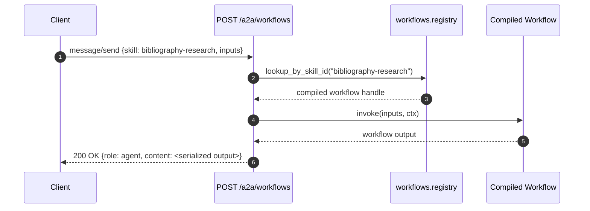
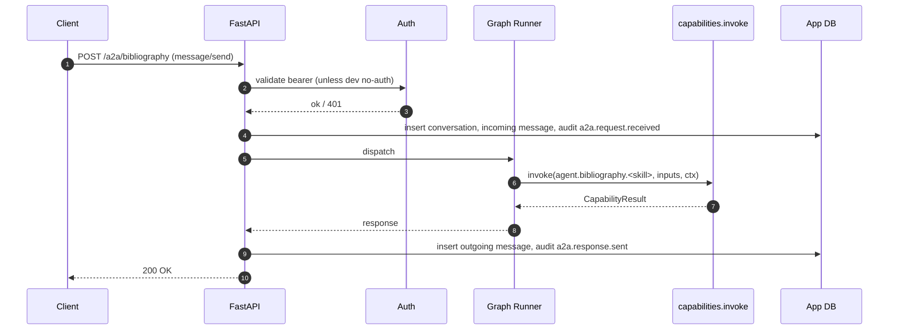
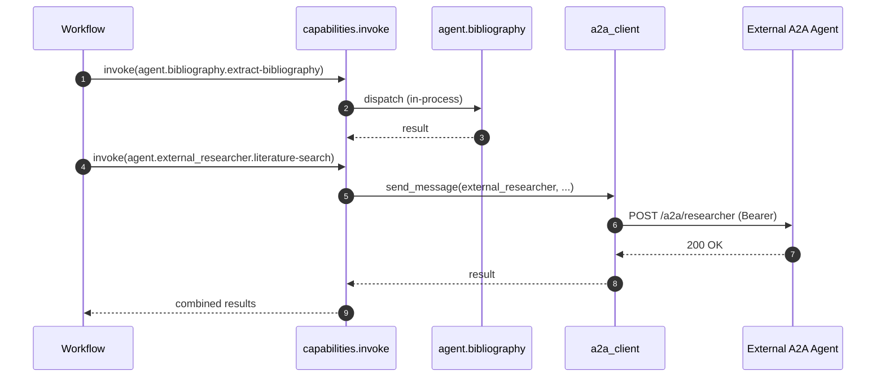
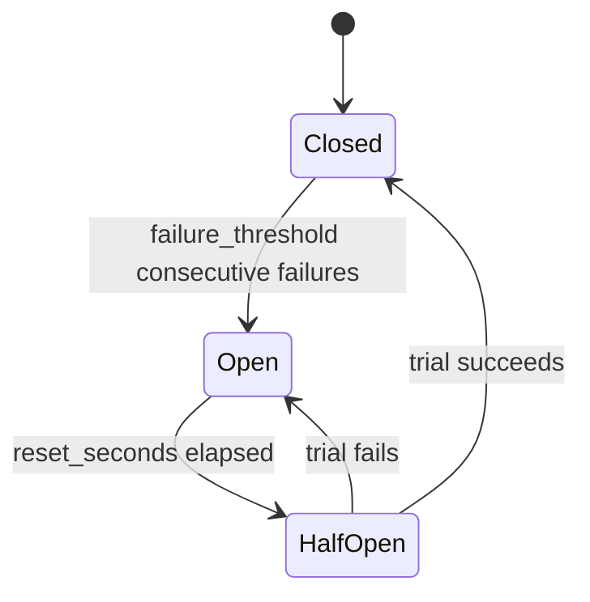

# 05 — A2A (Agent-to-Agent)

## 1. Purpose

Specify the runtime's **A2A surface** in both directions:

- **Inbound** — the FastAPI endpoints that serve agent cards and accept JSON-RPC `message/send`, `skills/list`, `agent/card`.
- **Outbound** — the `a2a_client` that lets workflows and local agents call **remote** A2A agents over the network.

Also specifies how **workflows become A2A skills** so they're externally discoverable and callable.

## 2. Concepts

- **Agent card** — the public discovery document at `/.well-known/agent-card.json` (and the legacy alias `/.well-known/agent.json`). Generated from [`agents.yaml`](../../agents.yaml).
- **A2A endpoint** — a per-agent URL of the form `/a2a/<agent_id>`. Each accepts JSON-RPC requests for that agent.
- **Synthetic `workflows` agent** — an in-memory agent the runtime creates on demand to expose workflows that have `exposed_as_skill` set. Routed at `/a2a/workflows`.
- **Outbound client** — `runtime/a2a_client.py`. Connects to remote agents declared with `runtime.kind: remote` in `agents.yaml`. Each remote skill becomes an `agent.<remote_id>.<skill>` capability.

## 3. Contract

### 3.1 Endpoints

| Method | Path | Purpose |
|--------|------|---------|
| `GET` | `/.well-known/agent-card.json` | Aggregate card (all locally exposed agents and the `workflows` agent). |
| `GET` | `/.well-known/agent.json` | Legacy alias of the above. |
| `POST` | `/a2a/{agent_id}` | JSON-RPC for a specific agent. |
| `POST` | `/a2a` | Optional default-agent alias (configured in `agents.yaml.runtime`). |
| `POST` | `/admin/reload` | Dev-only (`127.0.0.1`). Re-reads registries and reconciles. |
| `GET` | `/admin/remotes` | Dev-only. Returns per-remote status (connected / circuit-open / last error). |
| `GET` | `/metrics` | Dev-only Prometheus metrics (see [11-observability](11-observability.md)). |
| `GET` | `/healthz` | Liveness. |

### 3.2 Supported JSON-RPC methods (v0.1)

| Method | Params | Returns |
|--------|--------|---------|
| `agent/card` | `{}` | The current agent's portion of the card. |
| `skills/list` | `{}` | `{ skills: Skill[] }`. |
| `message/send` | `{ conversation_id?: string, message: { role, content }, skill?: string, inputs?: object, metadata?: { trace_id?: string } }` | `{ conversation_id, role, content, artifacts? }`. |

Notes:
- `skill` and `inputs` are used by the synthetic `workflows` agent and by skill-routed agents; for free-form chat agents the runtime infers skill from message content.
- `metadata.trace_id` (if supplied) becomes the trace root for the request (see [11-observability](11-observability.md#correlation-id-propagation)). If absent, a new trace ID is generated.

### 3.3 Authentication (inbound)

- When `ALLOW_DEV_NO_AUTH=true` and the connection is from `127.0.0.1`, requests without an `Authorization` header are accepted.
- Otherwise, `Authorization: Bearer <token>` is required, where `<token>` matches the agent's `env_token_name` env var.
- Tokens are **never** logged or written to audit rows. The auth middleware sets `ctx.bearer_token` on `InvocationContext` for outbound propagation.

### 3.4 Card generation rules

`registry/agent_card.py` builds the card from `agents.yaml`:

1. Include every **local** agent (`runtime.kind: local`).
2. **Exclude** every **remote** agent — they are *consumers* of A2A, not exposers (visible at `/admin/remotes` instead).
3. Append a synthetic `workflows` agent whose `skills` come from every workflow in `workflows.yaml` with `exposed_as_skill` set.
4. Write to both paths in `agents.yaml.runtime.generated_card_paths` (defaults: `.well-known/agent-card.json` + `.well-known/agent.json`).
5. **Strip** any keys matching the secret-name denylist before write; the validator (`scripts/validate_agent_card.py`) re-checks.

### 3.5 Outbound client (`a2a_client`)

Resolution from `agents.yaml` for `runtime.kind: remote`:

```python
class A2AClient:
    async def send_message(
        self,
        remote_id: str,
        skill: str | None,
        inputs: dict | str,
        conversation_id: str,
        ctx: InvocationContext,
        stream: bool = False,
    ) -> CapabilityResult | AsyncIterator[CapabilityChunk]: ...
```

Behavior:

- **Connection pool** per remote (`httpx.AsyncClient` keyed by `(remote_id)`), HTTP/2 enabled.
- **Auth**: read `agents[remote_id].runtime.remote.auth.token_env` at call time; insert `Authorization: Bearer ...`. Never log the value.
- **Timeouts**: `connect_timeout_seconds` and `read_timeout_seconds` from the remote's `resilience` block.
- **Retries**: per `resilience.retry`; only on `capability.upstream_error` and `capability.timeout`.
- **Circuit breaker**: per `resilience.circuit_breaker`. State transitions:
  - `Closed` → `Open` after `failure_threshold` consecutive failures.
  - `Open` for `reset_seconds`, then `HalfOpen` (single trial call).
  - `HalfOpen` → `Closed` on success, → `Open` on failure.
- **Streaming**: when the remote card advertises `capabilities.streaming = true`, the client subscribes via SSE and surfaces `CapabilityChunk` events.
- **Trace propagation**: emit `traceparent` header derived from `ctx.trace_id`.

### 3.6 Workflows-as-skills routing



Rules:
- `/a2a/workflows` only accepts methods whose `params.skill` matches a workflow with `exposed_as_skill`.
- Workflows without `exposed_as_skill` are reachable only via `workflow.<id>` from another workflow or agent.
- The `workflows` synthetic agent's card entry uses `id: workflows` and lists each exposed workflow as a skill.

## 4. Diagrams

### 4.1 Inbound flow with auth + audit



### 4.2 Multi-agent: workflow → local + remote



### 4.3 Outbound circuit breaker FSM



## 5. Failure modes

| Symptom | Cause | Behavior |
|---------|-------|----------|
| 401 on `/a2a/*` | Missing/wrong bearer | Logged with reason; never logs the supplied value. |
| Remote calls all return `capability.unavailable` | Circuit breaker open | Visible at `/admin/remotes`; resets after `reset_seconds`. |
| Skill name not on `/a2a/workflows` | Typo or workflow lacks `exposed_as_skill` | `capability.not_found`. |
| Outbound streaming returns final error mid-stream | Remote crashed | Terminal `CapabilityChunk(done=true)` followed by a logged `capability.upstream_error`. |
| Trace IDs not stitched across agents | Caller forgot `metadata.trace_id` (and we didn't emit `traceparent`) | New trace ID per request. Add `metadata.trace_id` from your caller. |

## 6. Extension points

- **More JSON-RPC methods** (e.g., `task/cancel`, `task/get`): add handler + method-name registration in `runtime/a2a_server.py`; update §3.2.
- **Per-skill auth**: extend the `auth` block in `agents.yaml` with a per-skill override; enforce in the auth middleware.
- **New outbound auth mode** (e.g., mTLS): extend `RemoteAuth` in `agents.yaml` schema and add a client-side adapter.
- **Card sync**: `scripts/sync_remote_cards.py` fetches remote cards and writes a diff of skill changes for human review (never auto-commits).

## 7. Worked example — remote agent + workflow

`agents.yaml` declares a remote:

```yaml
agents:
  external_researcher:
    runtime:
      kind: remote
      remote:
        base_url: http://10.0.0.5:8080
        a2a_endpoint: /a2a/researcher
        auth: { mode: bearer, token_env: EXTERNAL_RESEARCHER_TOKEN }
        resilience:
          retry: { max_attempts: 3, backoff_seconds: 1.0, jitter: true }
          circuit_breaker: { failure_threshold: 5, reset_seconds: 30 }
    skills:
      - { id: literature-search, name: Literature Search, description: ..., tags: [research] }
```

A workflow uses both local and remote agents:

```yaml
- id: enrich
  call: agent.external_researcher.literature-search
  with: { query: "{{ steps.extract.references[0].title }}" }
  retry: { max_attempts: 2, backoff_seconds: 1.0 }
  output: external_hits
```

At runtime, the call resolves to `a2a_client.send_message("external_researcher", "literature-search", ...)`. The bearer is read from `EXTERNAL_RESEARCHER_TOKEN` and never logged.

## 8. Cross-references

- [00-overview](00-overview.md) — request lifecycle diagrams.
- [01-config-and-registries](01-config-and-registries.md) — agent schema (local + remote).
- [02-capabilities](02-capabilities.md) — envelope, error codes (`capability.unavailable`, `capability.upstream_error`).
- [03-workflows](03-workflows.md) — exposure-as-skill rules.
- [08-security-and-policy](08-security-and-policy.md) — bearer rules.
- [11-observability](11-observability.md) — `a2a.request.received`, `a2a.response.sent` audit events; trace propagation.
