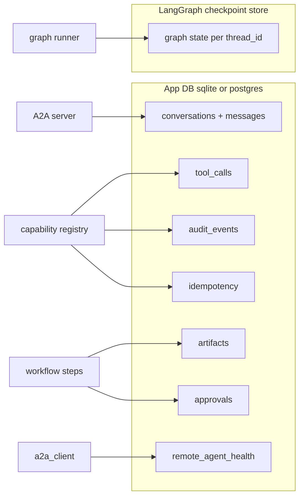

# 07 — Storage and Audit

## 1. Purpose

Define what the runtime persists, where, and why. Establish the **non-overlapping** boundary between **LangGraph checkpoint tables** (state lineage for resumability) and **app DB tables** (conversations, audit, idempotency, artifacts — used for governance, debugging, billing, replay).

Owning this separation explicitly avoids the anti-pattern of building admin dashboards on top of LangGraph internals.

## 2. Concepts

- **App DB** — owned by `runtime/storage.py`. Tables for conversational state and audit events. SQLite for local; Postgres in production. Schema in §3.2.
- **LangGraph checkpoint store** — owned by LangGraph itself via the saver returned from the checkpointer factory. Schema is internal to LangGraph and **not** queried by app code.
- **Audit event** — a row in `audit_events` with a stable `event_type` from the closed taxonomy in [11-observability §audit-event taxonomy](11-observability.md#3-contract).
- **Idempotency record** — a row in `idempotency` keyed by `(tenant_id, capability_uri, sha256(idempotency_key))` carrying the cached `CapabilityResult`.

## 3. Contract

### 3.1 Separation rules

| Concern | App DB | LangGraph checkpoints |
|---------|--------|----------------------|
| Source of truth for a conversation's *messages* | ✓ | ✗ |
| Source of truth for a workflow's *intermediate state* | ✗ | ✓ |
| Audit / billing / governance queries | ✓ | ✗ |
| Resumability after crash | ✗ | ✓ |
| Idempotency dedupe | ✓ | ✗ |
| Artifact paths + metadata | ✓ | ✗ |
| Time-travel debugging via LangGraph's API | informational | ✓ |

App code **never** writes to checkpoint tables and **never** reads them for governance. If you find yourself wanting to query checkpoint state for an admin UI, write the relevant facts to `audit_events` from inside the capability wrapper instead.

### 3.2 App DB schema (DDL)

```sql file=scripts/sql/app_schema.sql
-- Conversations
CREATE TABLE IF NOT EXISTS conversations (
  id              TEXT PRIMARY KEY,
  tenant_id       TEXT NOT NULL DEFAULT 'local',
  agent_id        TEXT NOT NULL,             -- 'workflows' for workflow-led conversations
  workflow_id     TEXT,                       -- nullable for non-workflow chats
  workflow_version TEXT,
  created_at      TEXT NOT NULL,
  updated_at      TEXT NOT NULL,
  metadata_json   TEXT
);
CREATE INDEX IF NOT EXISTS ix_conversations_tenant_agent
  ON conversations(tenant_id, agent_id, updated_at DESC);

-- Messages
CREATE TABLE IF NOT EXISTS messages (
  id              TEXT PRIMARY KEY,
  conversation_id TEXT NOT NULL REFERENCES conversations(id),
  role            TEXT NOT NULL,              -- user | agent | system
  content         TEXT NOT NULL,
  created_at      TEXT NOT NULL,
  metadata_json   TEXT
);
CREATE INDEX IF NOT EXISTS ix_messages_conv ON messages(conversation_id, created_at);

-- Tool calls (thin convenience view, also in audit_events)
CREATE TABLE IF NOT EXISTS tool_calls (
  id              TEXT PRIMARY KEY,
  conversation_id TEXT NOT NULL REFERENCES conversations(id),
  capability_uri  TEXT NOT NULL,
  input_json      TEXT,
  output_json     TEXT,
  error           TEXT,
  trace_id        TEXT,
  created_at      TEXT NOT NULL
);
CREATE INDEX IF NOT EXISTS ix_tool_calls_conv ON tool_calls(conversation_id, created_at);

-- Approvals (workflow human_approval)
CREATE TABLE IF NOT EXISTS approvals (
  id              TEXT PRIMARY KEY,
  conversation_id TEXT NOT NULL REFERENCES conversations(id),
  workflow_id     TEXT NOT NULL,
  workflow_version TEXT NOT NULL,
  step_id         TEXT NOT NULL,
  status          TEXT NOT NULL,              -- pending | approved | denied | expired
  request_json    TEXT,
  response_json   TEXT,
  created_at      TEXT NOT NULL,
  updated_at      TEXT NOT NULL
);
CREATE INDEX IF NOT EXISTS ix_approvals_pending
  ON approvals(status) WHERE status = 'pending';

-- Artifacts
CREATE TABLE IF NOT EXISTS artifacts (
  id              TEXT PRIMARY KEY,
  conversation_id TEXT NOT NULL REFERENCES conversations(id),
  path            TEXT NOT NULL,
  mime_type       TEXT,
  size_bytes      INTEGER,
  sha256          TEXT,
  metadata_json   TEXT,
  created_at      TEXT NOT NULL
);

-- Audit events (closed event_type taxonomy)
CREATE TABLE IF NOT EXISTS audit_events (
  id              TEXT PRIMARY KEY,
  tenant_id       TEXT NOT NULL DEFAULT 'local',
  agent_id        TEXT,
  workflow_id     TEXT,
  workflow_version TEXT,
  step_id         TEXT,
  conversation_id TEXT,
  capability_uri  TEXT,
  trace_id        TEXT,
  span_id         TEXT,
  event_type      TEXT NOT NULL,
  event_json      TEXT,
  created_at      TEXT NOT NULL
);
CREATE INDEX IF NOT EXISTS ix_audit_trace ON audit_events(trace_id);
CREATE INDEX IF NOT EXISTS ix_audit_event_type ON audit_events(event_type, created_at);
CREATE INDEX IF NOT EXISTS ix_audit_conv ON audit_events(conversation_id, created_at);

-- Idempotency
CREATE TABLE IF NOT EXISTS idempotency (
  id              TEXT PRIMARY KEY,           -- sha256(tenant_id || uri || idempotency_key)
  tenant_id       TEXT NOT NULL,
  capability_uri  TEXT NOT NULL,
  result_json     TEXT NOT NULL,
  expires_at      TEXT NOT NULL,
  created_at      TEXT NOT NULL
);
CREATE INDEX IF NOT EXISTS ix_idempotency_expiry ON idempotency(expires_at);

-- Remote agent health (consumed by /admin/remotes)
CREATE TABLE IF NOT EXISTS remote_agent_health (
  id              TEXT PRIMARY KEY,           -- remote agent id
  state           TEXT NOT NULL,              -- closed | half_open | open
  failure_count   INTEGER NOT NULL DEFAULT 0,
  last_error      TEXT,
  updated_at      TEXT NOT NULL
);
```

The same schema is created on SQLite (with `JSON` columns as `TEXT`) and Postgres (with `JSONB` columns where convenient). `scripts/db_init.py` runs the appropriate variant.

### 3.3 Write rules

- `conversations` / `messages` — written by `runtime/a2a_server.py` on inbound `message/send` and on outbound response.
- `tool_calls` — written by `runtime/capabilities.py` after every dispatch (success or failure). Mirrors `audit_events` for the common "what did this conversation do?" query.
- `approvals` — written by the `human_approval` workflow step.
- `artifacts` — written by the `emit_artifact` workflow step or by an agent skill that produces files.
- `audit_events` — written by the capability registry wrapper and by `runtime/a2a_server.py`. Closed `event_type` set; see [11-observability §3](11-observability.md#3-contract).
- `idempotency` — written by `runtime/capabilities.py` when `call.idempotency_key` is set; expired rows pruned by a background task or `scripts/db_prune.py`.
- `remote_agent_health` — written by `runtime/a2a_client.py` on each state transition of a remote's circuit breaker.

### 3.4 Retention

| Table | Default retention | Where configured |
|-------|-------------------|------------------|
| `conversations`, `messages` | 90 days | `APP_RETENTION_MESSAGES_DAYS` |
| `tool_calls` | 30 days | `APP_RETENTION_TOOL_CALLS_DAYS` |
| `audit_events` | 365 days | `APP_RETENTION_AUDIT_DAYS` |
| `idempotency` | 24 hours (per row `expires_at`) | per-call |
| `artifacts` | retained until referenced files are deleted | externally managed |
| `approvals` | 365 days | `APP_RETENTION_APPROVALS_DAYS` |
| LangGraph checkpoints | LangGraph default | LangGraph |

Pruning is performed by `scripts/db_prune.py` (run via cron / launchd). Deleted rows do not cascade to LangGraph; checkpoints are pruned by LangGraph's own retention if configured.

### 3.5 Migrations

- v0.1 ships a single forward-only `scripts/sql/app_schema.sql` (idempotent via `CREATE TABLE IF NOT EXISTS`).
- Future versions add numbered scripts `scripts/sql/0002_<change>.sql` plus a record in `schema_migrations(version, applied_at)`.
- `scripts/db_init.py --check` reports drift between the current schema and the latest expected version.

## 4. Diagrams

### 4.1 Where each kind of state lives



### 4.2 Query patterns

| Question | Query |
|----------|-------|
| "What did conversation X do?" | `SELECT * FROM tool_calls WHERE conversation_id = ?` plus `audit_events`. |
| "Was this idempotent call already serviced?" | `SELECT * FROM idempotency WHERE id = sha256(...)`. |
| "How many workflows ran today?" | `SELECT COUNT(*) FROM audit_events WHERE event_type = 'workflow.started' AND created_at >= ?`. |
| "Resume the bibliography workflow for conv-001" | LangGraph: load by `thread_id = 'local:workflow:bibliography_research:0.1.0:conv-001'`. |

## 5. Failure modes

| Symptom | Cause | Resolution |
|---------|-------|-----------|
| Duplicate side-effects after restart | Forgot `idempotency_key` and the call ran twice | Add `idempotency_key`; consider whether the action is naturally idempotent. |
| App DB grows unbounded | Retention scripts not scheduled | Schedule `scripts/db_prune.py`; check `APP_RETENTION_*` envs. |
| LangGraph state lost on schema bump | Workflow `version` was bumped mid-conversation | Expected — old thread is abandoned. Resume requires the prior version. |
| Audit gaps | Capability wrapper not the only invocation path | Audit gates live in `capabilities.invoke`; all callers must go through it. |

## 6. Extension points

- **Add a column**: extend `app_schema.sql` and write a numbered migration.
- **Multi-tenant query API**: every table already has `tenant_id`; add a tenant-aware accessor in `runtime/storage.py`.
- **External audit sink** (e.g., Kafka): subscribe to OTEL logs/events; do not bypass the DB write — the DB is the source of truth.
- **Per-capability TTL for idempotency**: extend `CapabilityCall` with `idempotency_ttl_seconds` (planned).

## 7. Worked example — replay a workflow's audit trail

```sql
SELECT created_at, event_type, step_id, capability_uri,
       json_extract(event_json, '$.duration_ms') AS dur_ms,
       json_extract(event_json, '$.ok') AS ok
FROM audit_events
WHERE conversation_id = 'conv-001'
  AND workflow_id = 'bibliography_research'
ORDER BY created_at;
```

Expected sequence (per [11-observability taxonomy](11-observability.md#3-contract)):

```
workflow.started
workflow.step.entered step_id=extract
  capability.invoked uri=agent.bibliography.extract-bibliography
  capability.completed
workflow.step.completed step_id=extract
workflow.step.entered step_id=resolve
  capability.invoked uri=agent.bibliography.resolve-open-access-pdfs
  capability.completed
workflow.step.completed step_id=resolve
workflow.step.entered step_id=approve
  workflow.approval.requested
... (operator approves) ...
workflow.approval.resolved
workflow.step.completed step_id=approve
workflow.step.entered step_id=download
  capability.invoked uri=mcp.filesystem-safe.download_url   (xN, parallel)
  capability.completed                                       (xN)
workflow.step.completed step_id=download
workflow.completed
```

## 8. Cross-references

- [02-capabilities](02-capabilities.md) — idempotency contract.
- [03-workflows](03-workflows.md) — `emit_artifact` and `human_approval` step semantics.
- [05-a2a](05-a2a.md) — what gets written to `conversations` and `messages`.
- [06-runtime-and-langgraph](06-runtime-and-langgraph.md) — checkpointer factory.
- [11-observability](11-observability.md) — audit-event taxonomy and structured logs.
- [13-traceability](13-traceability.md) — tracing backends and cross-agent correlation workflow.
