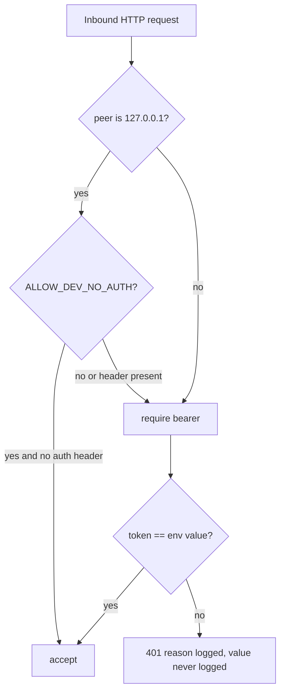
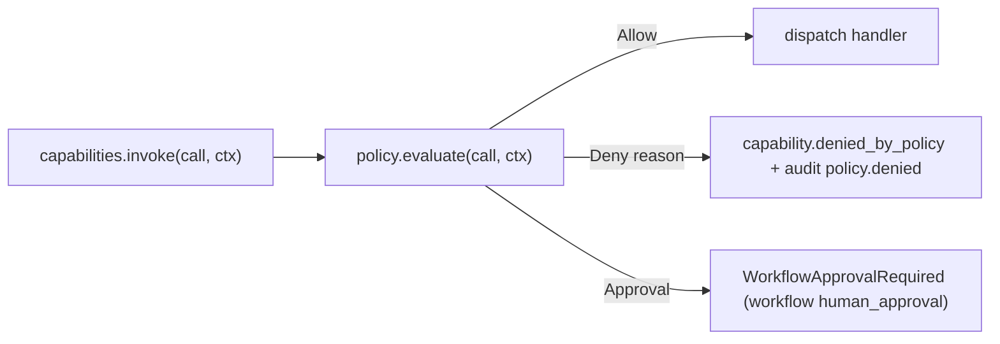

# 08 — Security and Policy

## 1. Purpose

Define the runtime's security posture: where authentication happens, how secrets flow, which allow/deny mechanisms exist, and how per-capability policy is enforced. All of this is small by design — fewer knobs, fewer places to get it wrong.

## 2. Concepts

- **Auth surface** — `runtime/security.py` (inbound A2A) and `runtime/a2a_client.py` (outbound).
- **Bearer token** — single shared secret per-deployment by default (`LOCAL_AGENT_TOKEN`); per-agent override via `auth.env_token_name` in `agents.yaml`.
- **Dev override** — `ALLOW_DEV_NO_AUTH=true` accepts unauthenticated requests **only** from `127.0.0.1`.
- **Policy hook** — single function (`policy.evaluate(call, ctx)`) consulted before every `capabilities.invoke` dispatch. Authoritative for "may this capability run with these inputs in this context?"
- **Secrets boundary** — env vars only. YAML, generated cards, `AGENTS.md`, and audit rows must not contain secret values.

## 3. Contract

### 3.1 Auth modes

| Mode | Where set | Inbound behavior |
|------|-----------|------------------|
| `local_bearer` (default for local agents) | `agents.<id>.auth` | Require `Authorization: Bearer <env_token_name value>`. |
| `none` | `agents.<id>.auth.mode: none` | No auth; only allowed when bind address is `127.0.0.1`. |
| dev no-auth | `ALLOW_DEV_NO_AUTH=true` env | Accept missing `Authorization` only if peer is `127.0.0.1`. |

Outbound auth (in `agents.<remote_id>.runtime.remote.auth`):

| Mode | Behavior |
|------|----------|
| `bearer` | `Authorization: Bearer <token_env value>`; read at call time. |
| `none` | No auth header. Allowed only against `http://127.0.0.1*` URLs unless `ALLOW_REMOTE_NONE_AUTH=true`. |

### 3.2 Bearer token lifecycle

- Tokens come from env (`LOCAL_AGENT_TOKEN`, `EXTERNAL_RESEARCHER_TOKEN`, ...). Never from YAML.
- The auth middleware **compares** tokens with `hmac.compare_digest` (constant-time).
- The middleware **never** logs tokens (or their lengths, or any prefix).
- `InvocationContext.bearer_token` carries the inbound token for propagation to outbound A2A calls when explicitly configured (per-remote opt-in via `agents.<id>.runtime.remote.auth.propagate_inbound: true`).

### 3.3 Bind address rules

- Default bind: `HOST=127.0.0.1`. Binding to a routable address requires `ALLOW_PUBLIC_BIND=true` and a configured non-`none` auth mode for every exposed agent.
- `/admin/*` and `/metrics` endpoints **always** require `127.0.0.1` (returns `404` otherwise).

### 3.4 Secret rules

- The following key names are **denied** in `agents.yaml`, `workflows.yaml`, `mcp_servers.yaml`, generated `AGENTS.md`, and `.well-known/*.json`. The security test parses each file and fails the build if any key (case-insensitive) appears:

```
token
secret
password
api_key
private_key
refresh_token
client_secret
service_account
bearer
credentials
```

- Allowed: `*_env`, `env_token_name`, `headers_env` — these reference env-var **names**.
- Workflow expressions cannot read these env-var names either; the expression sandbox's `env(...)` helper has its own narrow allowlist enforced in `runtime/workflows/expressions.py`.

### 3.5 Policy hook

```python
class Allow: pass

@dataclass
class Deny:
    reason: str

@dataclass
class Approval:
    approval_id: str
    prompt: str

def evaluate(call: CapabilityCall, ctx: InvocationContext) -> Allow | Deny | Approval: ...
```

Default policy (lives in `runtime/security.py`):

1. **MCP filter:** `mcp.<server>.<tool>` calls are denied unless the tool is on `mcp_servers.yaml.servers.<server>.capabilities_filter.allow_tools` (empty list means allow all).
2. **Remote breaker:** `agent.<remote>.<skill>` calls are denied when that remote's circuit breaker is `Open`.
3. **Filesystem deny patterns:** any `mcp.filesystem-safe.*` call with `inputs.path` (or `inputs.dest`) matching the deny patterns in the corresponding agent's `policy.filesystem.deny_patterns` is denied with `denied_by_policy`.
4. **Network allowlist:** any `mcp.fetch.*` call with `inputs.url` outside the union of `agents.<id>.policy.network.allow_domains` for the *invoking* agent (when known) is denied.
5. **Approval triggers (planned):** add `policy.approval_required_capabilities: [<uri-glob>]` per agent; default policy raises `Approval` for matching URIs.

Custom policies replace step 1 onwards but cannot relax 2–4 below their declared values.

### 3.6 Per-capability allow/deny

| Mechanism | Where declared | What it controls |
|-----------|----------------|------------------|
| MCP allow/deny tools | `mcp_servers.yaml.servers.<id>.capabilities_filter` | Which discovered tools become capabilities. |
| Agent policy.filesystem | `agents.<id>.policy.filesystem` | Per-call deny patterns for path-bearing tool inputs. |
| Agent policy.network | `agents.<id>.policy.network` | URL allowlist for `mcp.fetch.*`. |
| Workflow `on_error` | `workflows.yaml` per step | Determines failure handling, not whether the call may run. |

## 4. Diagrams

### 4.1 Inbound auth



### 4.2 Policy enforcement seam



## 5. Failure modes

| Symptom | Cause | Resolution |
|---------|-------|------------|
| All inbound `/a2a/*` fail with 401 | Wrong env token, missing header | Check `LOCAL_AGENT_TOKEN`; check Authorization header shape. |
| `policy.denied` for a brand-new MCP tool | Not on `allow_tools` | Add to `capabilities_filter.allow_tools`; redeploy/reload. |
| Workflow loops sending the same `mcp.fetch.get_json` and getting `denied_by_policy` | URL not on `allow_domains` for the invoking agent | Add the host to that agent's `policy.network.allow_domains`. |
| Audit row contains a token | Bug: handler logged inputs verbatim | Remove the log; tokens must never enter `event_json`. The security test (`tests/security/test_secret_leak.py`) scans audit rows. |
| `/metrics` returns 404 | Bound to public address | `/metrics` is `127.0.0.1` only. Use a reverse proxy to expose if you must. |

## 6. Extension points

- **Custom policy class**: implement `Policy` and pass into `Capabilities`; preserves steps 2–4 above. Document overrides in your fork's `08-security-and-policy.md`.
- **mTLS for outbound A2A**: extend `RemoteAuth` in `agents.yaml` schema and add a client adapter (treated as a schema bump per [01-config-and-registries §7](01-config-and-registries.md#7-schema-versioning-and-migrations)).
- **OPA / Cedar integration**: implement a `Policy` that shells out to an external engine; cache decisions per `(uri, sha256(inputs))` if latency matters.
- **Per-skill bearer**: add `auth.<skill_id>` override under each agent; enforce in the auth middleware.

## 7. Worked example — adding a per-MCP-tool deny

Forbid the filesystem tool from touching anything under `~/.aws`:

```yaml file=agents.yaml
# ... within agents.bibliography.policy.filesystem ...
deny_patterns:
  - ~/.ssh
  - ~/.aws
  - ~/.config/gcloud
```

After reload, any workflow step like:

```yaml
- id: leak
  call: mcp.filesystem-safe.read_file
  with: { path: "~/.aws/credentials" }
```

returns `CapabilityError(code="capability.denied_by_policy", details={"matched_pattern": "~/.aws"})`. The denial is recorded as a `policy.denied` audit event with the matched pattern; the input value (the path itself) is **truncated** to the matched prefix to avoid surfacing useful data.

## 8. Cross-references

- [02-capabilities](02-capabilities.md) — policy hook in the invocation contract.
- [04-mcp-integration](04-mcp-integration.md) — `capabilities_filter` semantics.
- [05-a2a](05-a2a.md) — outbound bearer rules.
- [07-storage-and-audit](07-storage-and-audit.md) — `policy.denied` audit events.
- [11-observability](11-observability.md) — secret-handling guarantees in logs.
