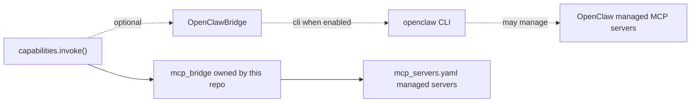

# 09 — OpenClaw

## 1. Purpose

Specify the runtime's relationship to **OpenClaw** — the local agent shell / MCP and operator interface. OpenClaw is **disabled by default**. This doc states what the bridge does, what it does *not* assume, and how to enable it once a local CLI is verified.

## 2. Concepts

- **OpenClaw** — a local agent shell intended to manage MCP servers and provide an operator interface in front of installed agents.
- **OpenClaw bridge** (`src/agent_stack/runtime/openclaw_bridge.py`) — a thin adapter that may shell out to the OpenClaw CLI when explicitly enabled. **Not** required for any v0.1 functionality.
- **`OPENCLAW_ENABLED`** — the master env flag. Default `false`.

The runtime works in full without OpenClaw. Treat OpenClaw as a future integration that can manage agents and MCP servers at a higher level than this repo.

## 3. Contract

### 3.1 Disabled-by-default behavior

When `OPENCLAW_ENABLED=false` (the default):

- `OpenClawBridge.invoke_agent(...)` returns `{"status": "disabled", "message": "OpenClaw bridge disabled"}`.
- No subprocesses are spawned.
- No CLI presence is required.

### 3.2 Bridge interface (sketch)

```python
class OpenClawBridge:
    def __init__(self, enabled: bool): ...

    async def list_mcp_servers(self) -> list[dict]:
        """Returns OpenClaw's known MCP servers. Disabled: []."""

    async def invoke_agent(self, agent_id: str, message: str) -> dict:
        """Invoke an agent through OpenClaw. Disabled: returns {status: disabled}."""

    async def health(self) -> dict:
        """Returns CLI presence and version info, or {ok: False, reason: ...}."""
```

### 3.3 Enablement

1. Install OpenClaw locally; run `scripts/openclaw_check.sh` to verify CLI presence.
2. Set `OPENCLAW_ENABLED=true` in `.env`.
3. Implement bridge methods against the **verified** local CLI shape — do **not** assume argument names from documentation alone.
4. Add an integration test in `tests/integration/test_openclaw_bridge.py` that exercises the actual CLI; gate it with a `requires_openclaw` pytest mark.

### 3.4 Things this bridge does *not* assume

- A specific config file path (e.g., `~/.openclaw/config.yaml`) — implementation must be configurable.
- A specific subcommand grammar — implementation must verify against `--help` of the installed binary.
- That OpenClaw owns MCP server lifecycles in our process — this repo's `mcp_bridge` is independent and authoritative for `mcp_servers.yaml`.

If OpenClaw's MCP list overlaps with `mcp_servers.yaml`, the runtime always prefers the local `mcp_servers.yaml` declaration. OpenClaw's view is informational (visible at `/admin/openclaw` when enabled).

## 4. Diagrams



The dotted edges show why OpenClaw is optional: the runtime's hot path doesn't depend on it.

## 5. Failure modes

| Symptom | Cause | Behavior |
|---------|-------|----------|
| `openclaw CLI not found` from `scripts/openclaw_check.sh` | Not installed | Script exits non-zero with install hint. |
| Bridge enabled but `invoke_agent` raises `NotImplementedError` | Local CLI shape not verified yet | Surface in `/admin/openclaw`; do not retry. |
| OpenClaw lists an MCP server we don't have | Out of sync | Informational; runtime ignores. |
| OpenClaw missing an MCP server we have | Out of sync | Informational; runtime continues with its own bridge. |

## 6. Extension points

- **CLI shape adapter**: implement against `openclaw --help` output once locally available; commit the adapter behind `OPENCLAW_ENABLED`.
- **Mirror our MCP servers into OpenClaw**: optional helper script under `scripts/openclaw_sync.sh` (out of scope for v0.1).

## 7. Worked example — verifying OpenClaw

```bash file=scripts/openclaw_check.sh
#!/usr/bin/env bash
set -euo pipefail

if ! command -v openclaw >/dev/null 2>&1; then
  echo "openclaw CLI not found. Install OpenClaw or unset OPENCLAW_ENABLED."
  exit 1
fi

openclaw --help >/dev/null
echo "openclaw CLI present:"
openclaw --version || true
openclaw mcp list || true
```

When this script exits 0, you may flip `OPENCLAW_ENABLED=true` and implement bridge methods against the verified CLI.

## 8. Cross-references

- [04-mcp-integration](04-mcp-integration.md) — the authoritative MCP bridge in this repo.
- [10-nemoclaw](10-nemoclaw.md) — sandbox model that may host OpenClaw.
- [08-security-and-policy](08-security-and-policy.md) — `OPENCLAW_ENABLED` is governed by the same env-only secret rules.
