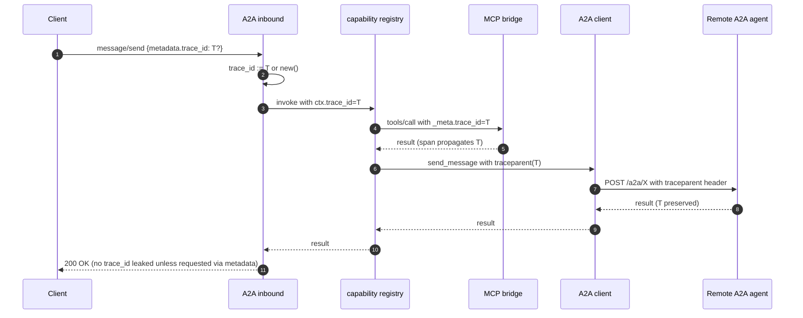
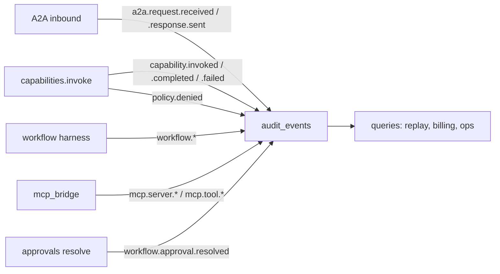
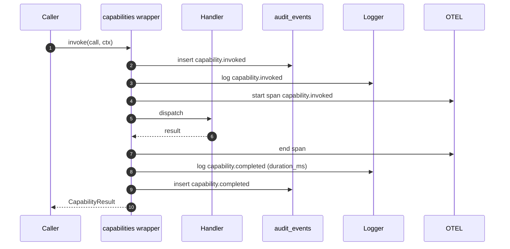

# 11 — Observability

## 1. Purpose

Pin the runtime's observability contract: the **structured log schema**, **OpenTelemetry span attributes**, **metric catalog**, **audit-event taxonomy**, and **correlation-ID propagation**. These are the load-bearing primitives for debugging, replay, and (later) billing — they must be stable across versions and uniform across every capability.

## 2. Concepts

- **Structured log** — every log line is JSON with stable keys; printed to stdout in v0.1.
- **OTEL span** — every capability invocation and every workflow step gets one span. Exported via the standard OTLP env vars.
- **Metric** — counters, histograms, gauges with **pinned names**. Exposed at `/metrics` (Prometheus) on `127.0.0.1` only.
- **Audit event** — a row in `audit_events` with an `event_type` from the closed taxonomy below. The audit table is the durable, queryable backbone; logs and traces are best-effort.
- **Correlation ID** — a `trace_id` that stitches inbound A2A, internal capability calls, MCP calls, and outbound A2A.

## 3. Contract

### 3.1 Structured log schema

Every line is a single-line JSON object. Required keys:

```json
{
  "ts": "2026-05-24T23:01:00.123Z",
  "level": "INFO",
  "logger": "agent_stack.runtime.capabilities",
  "msg": "capability.invoked",
  "trace_id": "0af7651916cd43dd8448eb211c80319c",
  "span_id": "b7ad6b7169203331"
}
```

Optional keys (added when relevant):

| Key | Type | When set |
|-----|------|----------|
| `tenant_id` | string | always (default `local`) |
| `agent_id` | string | when inside an agent-handled request |
| `workflow_id` | string | when inside a workflow |
| `workflow_version` | string | when inside a workflow |
| `step_id` | string | when inside a workflow step |
| `capability_uri` | string | for `capability.*` messages |
| `capability_scheme` | string (`mcp` \| `agent` \| `workflow` \| `builtin`) | for `capability.*` messages |
| `mcp_server` | string | for `mcp.*` messages |
| `mcp_tool` | string | for `mcp.*` messages |
| `a2a_method` | string | for `a2a.*` messages |
| `a2a_remote_agent` | string | for outbound calls |
| `duration_ms` | int | terminal events |
| `ok` | bool | terminal events |
| `error_code` | string | on failure |

Forbidden in logs:

- Bearer tokens or env-var **values** that look secret-shaped.
- Raw request bodies that contain user-supplied secrets. The runtime truncates path-like values that match deny patterns (per [08-security-and-policy §7](08-security-and-policy.md#7-worked-example--adding-a-per-mcp-tool-deny)).

### 3.2 OpenTelemetry span attribute conventions

Span name = the value of the corresponding audit `event_type` (e.g., `capability.invoked`, `workflow.step.entered`). Stable attribute names:

| Attribute | Type | On |
|-----------|------|----|
| `agent.id` | string | agent-bearing operations |
| `agent.skill` | string | when a specific skill is targeted |
| `workflow.id` | string | workflow operations |
| `workflow.version` | string | workflow operations |
| `workflow.step_id` | string | workflow steps |
| `capability.uri` | string | every capability dispatch |
| `capability.scheme` | string | every capability dispatch |
| `mcp.server` | string | MCP dispatches |
| `mcp.tool` | string | MCP dispatches |
| `a2a.method` | string | inbound A2A handlers |
| `a2a.remote_agent` | string | outbound A2A calls |
| `idempotency.hit` | bool | when idempotency replay short-circuits |
| `error.code` | string | on failure |
| `error.retryable` | bool | on failure |

Exporter: configured via standard envs `OTEL_EXPORTER_OTLP_ENDPOINT`, `OTEL_SERVICE_NAME=agent_stack`. When unset, spans go to a no-op exporter.

### 3.3 Metric catalog

Prometheus-style names (all served at `/metrics` on `127.0.0.1`):

| Name | Kind | Labels | Notes |
|------|------|--------|-------|
| `capability_invocations_total` | counter | `scheme`, `uri`, `ok` | One per dispatch. |
| `capability_duration_ms` | histogram | `scheme`, `uri` | Default buckets: 5,10,25,50,100,250,500,1000,2500,5000,10000. |
| `capability_errors_total` | counter | `scheme`, `uri`, `error_code` | Mirrors `capability_invocations_total{ok="false"}` but split by code. |
| `workflow_runs_total` | counter | `workflow_id`, `version`, `terminal_state` | `terminal_state` ∈ {`completed`, `failed`, `pending_approval`}. |
| `workflow_step_duration_ms` | histogram | `workflow_id`, `step_id` | Per step. |
| `mcp_server_up` | gauge | `server_id` | 1 when `Ready`, 0 otherwise. |
| `mcp_server_restarts_total` | counter | `server_id` | Increments on each `Backoff → Starting` transition. |
| `a2a_inbound_requests_total` | counter | `method`, `agent_id`, `ok` | One per inbound JSON-RPC call. |
| `a2a_outbound_requests_total` | counter | `remote_agent`, `ok` | One per outbound call (including retries). |
| `a2a_circuit_breaker_state` | gauge | `remote_agent`, `state` | 1/0 per state for each remote. |
| `audit_events_total` | counter | `event_type` | Sanity counter mirroring the audit table. |

### 3.4 Audit-event taxonomy (closed set)

Written to `audit_events.event_type`. **Stable** names; additions require updating this table and the corresponding test in `tests/unit/test_audit_taxonomy.py`.

| Event | Emitted by | Notes |
|-------|------------|-------|
| `a2a.request.received` | `a2a_server` | Includes `a2a.method`. |
| `a2a.response.sent` | `a2a_server` | Includes `duration_ms`, `ok`. |
| `capability.invoked` | `capabilities` wrapper | One per dispatch. |
| `capability.completed` | `capabilities` wrapper | Terminal success. |
| `capability.failed` | `capabilities` wrapper | Terminal failure with `error_code`. |
| `workflow.started` | workflow compiler harness | Includes `workflow.id`, `workflow.version`. |
| `workflow.step.entered` | workflow compiler harness | Per step (skipped steps emit with `skipped=true`). |
| `workflow.step.completed` | workflow compiler harness | Includes `duration_ms`. |
| `workflow.approval.requested` | `human_approval` step | Includes `approval_id`. |
| `workflow.approval.resolved` | resolve endpoint | Includes `status`. |
| `workflow.completed` | workflow harness | Terminal success. |
| `workflow.failed` | workflow harness | Terminal failure. |
| `mcp.server.started` | `mcp_bridge` | Includes `mcp.server`. |
| `mcp.server.crashed` | `mcp_bridge` | Includes exit reason. |
| `mcp.server.unrecoverable` | `mcp_bridge` | After backoff cap. |
| `mcp.tool.discovered` | `mcp_bridge` | On every successful discovery. |
| `mcp.tool.schema_changed` | `mcp_bridge` | When tool schema hash differs from cache. |
| `policy.denied` | `capabilities` wrapper | After `Deny` decision. |

### 3.5 Correlation-ID propagation



Rules:

- Inbound: read `params.metadata.trace_id` if present and well-formed (32-hex). Else generate a new one.
- Outbound A2A: always emit a W3C `traceparent` header derived from `ctx.trace_id` and the current span id.
- MCP JSON-RPC: include `_meta: { trace_id, span_id }` in `tools/call` params; servers that ignore `_meta` are unaffected.
- Idempotency replays carry the **original** `trace_id` only when the cached `CapabilityResult` is returned (we do not invent a new trace for a replay).

### 3.6 Sinks (v0.1 defaults)

| Stream | Sink | Override |
|--------|------|----------|
| Logs | stdout JSON | `LOG_LEVEL=INFO`, `LOG_FORMAT=json` |
| OTEL | no-op unless `OTEL_EXPORTER_OTLP_ENDPOINT` set | standard OTEL envs |
| Metrics | `/metrics` on `127.0.0.1` | `METRICS_ENABLED=true` (default), `METRICS_PATH=/metrics` |

For backend topology and operator workflows (Jaeger/Grafana Tempo), see [13-traceability](13-traceability.md).

## 4. Diagrams

### 4.1 Where every event is produced



### 4.2 Log + span + audit produced from one capability call



## 5. Failure modes

| Symptom | Cause | Resolution |
|---------|-------|------------|
| `/metrics` returns 404 from non-localhost | By design | Tunnel via reverse proxy / SSH. |
| Span tree missing across A2A boundary | Caller did not emit `traceparent` | The outbound client *always* emits it; verify the *inbound* server accepts it. |
| Audit count diverges from metrics count | Bug in a wrapper bypass | All dispatch must go through `capabilities.invoke`. Add a test or audit-side assertion. |
| Logs leak a bearer | Handler logged inputs verbatim | `tests/security/test_secret_leak.py` scans logs in CI; fix the handler. |
| `mcp.tool.schema_changed` event flood | Server emits non-deterministic schema | Pin the upstream MCP server version; investigate the schema diff. |

## 6. Extension points

- **New audit event type**: add to §3.4 table and to `tests/unit/test_audit_taxonomy.py`. Stable existing events are never renamed.
- **New metric**: add to §3.3 with labels; emit from the appropriate runtime module.
- **External sink**: implement a log subscriber that forwards JSON lines to your aggregator. Do not bypass `audit_events` — it is the source of truth.
- **Sampled tracing**: configure standard OTEL sampler envs; the runtime does not implement its own sampler.

## 7. Worked example — a workflow's complete observability footprint

A successful run of `bibliography_research` with three references and one approval:

```text
LOG  capability.invoked  workflow_id=bibliography_research step_id=extract uri=agent.bibliography.extract-bibliography
SPAN capability.invoked  ... (412 ms)
LOG  capability.completed duration_ms=412 ok=true
AUDIT capability.invoked / capability.completed
LOG  workflow.step.completed step_id=extract duration_ms=414
AUDIT workflow.step.completed
... (resolve, approve, download steps follow the same pattern)
METRIC capability_invocations_total{scheme="agent",uri="agent.bibliography.extract-bibliography",ok="true"} +1
METRIC capability_duration_ms histogram observation 412
METRIC workflow_runs_total{workflow_id="bibliography_research",version="0.1.0",terminal_state="completed"} +1
```

## 8. Cross-references

- [02-capabilities](02-capabilities.md) — the wrapper that produces every `capability.*` event.
- [03-workflows](03-workflows.md) — workflow events and step semantics.
- [04-mcp-integration](04-mcp-integration.md) — `mcp.server.*` and `mcp.tool.*` event sources.
- [05-a2a](05-a2a.md) — inbound/outbound trace propagation.
- [07-storage-and-audit](07-storage-and-audit.md) — the `audit_events` table and query patterns.
- [08-security-and-policy](08-security-and-policy.md) — secret-redaction guarantees.
