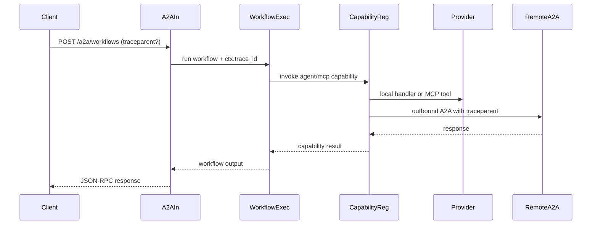
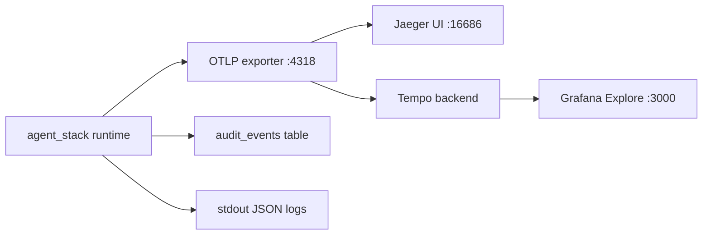

# 13 — Traceability

## 1. Purpose

Define how a single request is traced across inbound A2A, workflow steps, capability dispatch, outbound A2A, and MCP calls. This document is the operator guide for Jaeger/Tempo usage and trace-debug workflows. The canonical span and audit contracts remain in [11-observability](11-observability.md).

## 2. Concepts

- **Trace ID** — shared identifier across all spans in one end-to-end request.
- **Span ID** — identifier for one operation inside a trace.
- **`traceparent`** — W3C propagation header used across HTTP boundaries.
- **Conversation ID** — application-level request lineage key used in `messages`/`audit_events`.
- **Sinks** — traces (OTEL backend), app audit rows (`audit_events`), and structured logs.

## 3. Contract

### 3.1 Propagation rules

1. Inbound A2A reads request `traceparent` when present.
2. If no inbound header exists, caller-provided `params.metadata.trace_id` seeds the runtime context.
3. Capability wrapper emits a span named `capability.invoked` and child spans for workflow step wrappers.
4. Outbound A2A injects `traceparent` via OTEL propagators and also forwards `metadata.trace_id`.
5. MCP propagation uses capability-level spans now; `_meta.trace_id` is added when MCP subprocess transport is implemented.

### 3.2 Span hierarchy

| Layer | Span names | Core attributes |
|------|------------|-----------------|
| Inbound API | `a2a.request.received`, `a2a.response.sent` | `a2a.method`, `agent.id`, `conversation_id` |
| Workflow | `workflow.started`, `workflow.step.entered`, `workflow.step.completed`, `workflow.completed`, `workflow.failed` | `workflow.id`, `workflow.version`, `workflow.step_id` |
| Capability dispatch | `capability.invoked` | `capability.uri`, `capability.scheme`, workflow attrs |
| Approval | `workflow.approval.requested` | `approval_id`, workflow attrs |
| Outbound remote | HTTP client spans + injected context | `http.*`, `net.*`, remote endpoint |

### 3.3 Sink responsibilities

| Sink | Strength | Use for |
|------|----------|---------|
| OTEL backend (Jaeger/Tempo) | timeline/tree visualization | interactive debugging |
| `audit_events` | durable source of truth | replay, governance, reporting |
| JSON logs | low-friction local diagnostics | quick local inspection |

## 4. Diagrams

### 4.1 End-to-end propagation



### 4.2 Backend topology



## 5. Backends

### 5.1 Jaeger all-in-one

- Start: `docker compose -f docker-compose.jaeger.yml up -d`
- UI: `http://127.0.0.1:16686`
- OTLP endpoint: `http://127.0.0.1:4318`

### 5.2 Grafana + Tempo

- Start: `docker compose -f docker-compose.observability.yml up -d`
- Grafana UI: `http://127.0.0.1:3000`
- Tempo OTLP receiver: `http://127.0.0.1:4318`

## 6. Operator workflows

1. Run the stack with OTEL enabled (`OTEL_EXPORTER_OTLP_ENDPOINT`, `OTEL_SERVICE_NAME`).
2. Trigger a request with explicit `metadata.trace_id`.
3. Query Jaeger by service `agent_stack`, or Grafana Explore using TraceQL:
   - `{ resource.service.name = "agent_stack" }`
   - `{ span.capability.uri = "agent.bibliography.extract-bibliography" }`
4. Correlate failures with `audit_events` using the same `trace_id`.

## 7. Multi-agent scenarios

| Scenario | Trace expectation |
|---------|-------------------|
| workflow -> local agent skills | nested child spans under workflow step |
| workflow -> MCP tools | capability spans with `capability.scheme=mcp` |
| workflow -> remote A2A | HTTP client span + downstream trace if remote participates |
| concurrent workflow runs | separate traces; shared service name |

## 8. Failure modes

| Symptom | Likely cause | Resolution |
|--------|--------------|------------|
| Broken trace chain across remote call | remote does not accept W3C context | keep `metadata.trace_id`, add remote-side OTEL extraction |
| Duplicate HTTP spans | manual + auto instrumentation overlap | keep one semantic span + auto HTTP spans, avoid duplicate wrappers |
| No traces exported | OTEL endpoint unset or backend down | verify `.env`, collector endpoint, backend containers |
| Sparse traces in production | sampling too low | adjust `OTEL_TRACES_SAMPLER` / `OTEL_TRACES_SAMPLER_ARG` |

## 9. Extension points

- Add span attributes for new workflow step kinds.
- Add MCP `_meta.trace_id` propagation once subprocess bridge lands.
- Insert OTEL Collector/Alloy between runtime and Tempo for batching/sampling.
- Add cookbook recipe for trace-based workflow debugging.

## 10. Worked example

Run `bibliography-research` with:

```bash
curl -s -X POST http://127.0.0.1:8086/a2a/workflows \
  -H 'Content-Type: application/json' \
  -H 'Authorization: Bearer dev-token' \
  -d '{"jsonrpc":"2.0","id":"1","method":"message/send","params":{"skill":"bibliography-research","inputs":{"pdf_path":"./data/paper.pdf"},"metadata":{"trace_id":"0123456789abcdef0123456789abcdef"}}}'
```

Expected span tree:

- `a2a.request.received`
  - `workflow.started`
    - `workflow.step.entered` (`extract`)
      - `capability.invoked` (`agent.bibliography.extract-bibliography`)
    - `workflow.step.entered` (`resolve`)
      - `capability.invoked` (`agent.bibliography.resolve-open-access-pdfs`)
    - `workflow.completed`
  - `a2a.response.sent`

Then correlate in SQL:

```sql
SELECT created_at, event_type, trace_id, capability_uri
FROM audit_events
WHERE trace_id = '0123456789abcdef0123456789abcdef'
ORDER BY created_at;
```

## 11. Cross-references

- [02-capabilities](02-capabilities.md) — invocation wrapper and URI routing.
- [05-a2a](05-a2a.md) — inbound/outbound request semantics and remote calls.
- [07-storage-and-audit](07-storage-and-audit.md) — durable audit model.
- [11-observability](11-observability.md) — span/log/metric/audit contract.
- [12-extension-cookbook](12-extension-cookbook.md) — extension recipes.
