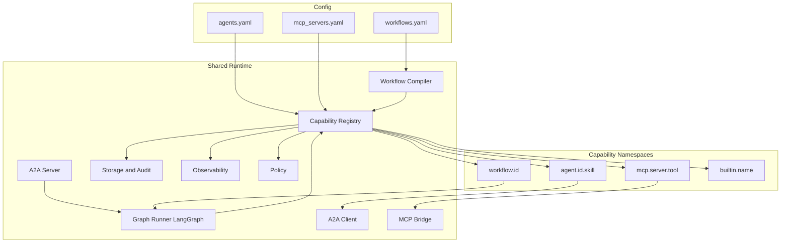

# Build Plan: Workflow-Driven Local Agent Stack

Version: 1.0
Status: canonical (supersedes [`docs/legacy/openclaw_nemoclaw_a2a_cursor_implementation.md`](legacy/openclaw_nemoclaw_a2a_cursor_implementation.md))

## 1. Goal

Deliver a local agent runtime where **MCP tools**, **A2A agent skills**, and **declarative workflows** are unified under one capability model. New workflows can be created by editing `workflows.yaml` — no Python required for the common case.

Implementation lives in-place at the repo root (no `local-agent-stack/` subdirectory).

## 2. The three first-class artifacts

| File | Role | Audience | Loaded by |
|------|------|----------|-----------|
| [`agents.yaml.example`](../agents.yaml.example) | local + remote agents (sample; copy to private `agents.yaml`) | runtime + generator | `registry/config.py` |
| [`mcp_servers.yaml.example`](../mcp_servers.yaml.example) | MCP server registry sample | runtime | `runtime/mcp_bridge.py` |
| [`workflows.yaml.example`](../workflows.yaml.example) | declarative workflow sample | runtime + generator | `runtime/workflows/compiler.py` |

All three files carry a `schema_version` field; unknown versions are rejected by the loader and a migration table in [`docs/architecture/01-config-and-registries.md`](architecture/01-config-and-registries.md) tracks bumps.

## 3. The capability model

Every callable thing in the system has a stable URI. There is **one** invocation function:

```python
capabilities.invoke(uri: str, inputs: dict, ctx: InvocationContext) -> CapabilityResult
```

URI grammar:

```
mcp.<server>.<tool>           # e.g., mcp.filesystem-safe.read_file
agent.<agent_id>.<skill_id>   # local or remote; transport decided at resolution
workflow.<workflow_id>        # a compiled workflow as a callable capability
builtin.<name>                # branch | parallel | for_each | human_approval | assign | emit_artifact
```

This single seam is where auth, policy, audit, tracing, idempotency, cancellation, and streaming are applied. See [`docs/architecture/02-capabilities.md`](architecture/02-capabilities.md) for the full envelope and error taxonomy.

## 4. Layers and their boundaries



## 5. Repo layout (target)

```
agents101/
  pyproject.toml
  .env.example
  agents.yaml
  workflows.yaml
  mcp_servers.yaml
  AGENTS.md                          # generated
  .well-known/
    agent-card.json                  # generated
    agent.json                       # generated
  src/agent_stack/
    main.py
    runtime/
      a2a_server.py
      a2a_client.py
      capabilities.py
      mcp_bridge.py
      graph_runner.py
      checkpointer.py
      storage.py
      audit.py
      security.py
      observability.py
      openclaw_bridge.py
      workflows/
        schema.py
        compiler.py
        steps.py
        expressions.py
        registry.py
    registry/
      config.py
      schemas.py
      agent_card.py
      instructions.py                # AGENTS.md generation
    agents/
      generic_agent/       { state.py, graph.py, prompts.py, tools.py, AGENTS.md }
      bibliography_agent/  { state.py, graph.py, prompts.py, tools.py, AGENTS.md }
    tools/
      filesystem_safe.py
      echo.py
  scripts/
    generate_agent_artifacts.py
    validate_agent_card.py
    validate_workflows.py
    sync_remote_cards.py
    db_init.py
    openclaw_check.sh
    run_in_nemoclaw.sh
  docs/
    build-plan.md
    architecture/                    # 13 docs (00..12)
    legacy/openclaw_nemoclaw_a2a_cursor_implementation.md
  tests/
    unit/        integration/        contract/
    security/    golden/             chaos/
    test_docs_snippets.py            # doc-drift invariant
```

## 6. Phased execution

Each phase has acceptance commands and a mandatory test suite from the taxonomy in §8.

### Phase 0 — Repo bootstrap

- `git init`, set `origin = git@github.com:ljohri/agents101.git`.
- `.gitignore`, `README.md`, initial commit on `main`.
- **Acceptance:** `git remote -v` shows origin; `main` pushed.

### Phase 1 — Config registries + scaffold

- `pyproject.toml` (uv), `.env.example`.
- Pydantic schemas in `registry/schemas.py` for `agents.yaml`, `workflows.yaml`, `mcp_servers.yaml`.
- `registry/config.py` loader that validates `schema_version` and parses all three.
- `src/agent_stack/main.py` with `GET /healthz` only.
- **Acceptance:**

  ```bash
  uv sync --extra dev
  uv run pytest tests/unit/test_agents_yaml.py tests/unit/test_workflows_yaml.py tests/unit/test_mcp_servers_yaml.py
  uv run uvicorn agent_stack.main:app --host 127.0.0.1 --port 8086 &
  curl -fsS http://127.0.0.1:8086/healthz
  ```

### Phase 2 — Artifact generation

- `registry/agent_card.py` (generates `.well-known/agent-card.json` + `agent.json`, includes exposed workflow skills on a synthetic `workflows` agent).
- `registry/instructions.py` (generates root `AGENTS.md`).
- `scripts/generate_agent_artifacts.py`, `scripts/validate_agent_card.py`.
- Golden-file tests in `tests/golden/` for both generators.
- **Acceptance:**

  ```bash
  uv run python scripts/generate_agent_artifacts.py
  uv run python scripts/validate_agent_card.py .well-known/agent-card.json
  uv run pytest tests/golden/
  ```

### Phase 3 — Shared A2A server

- `runtime/a2a_server.py`: `GET /.well-known/agent-card.json`, `GET /.well-known/agent.json`, `POST /a2a/{agent_id}`, optional `POST /a2a`.
- Methods: `agent/card`, `skills/list`, `message/send`.
- `runtime/security.py` (bearer + dev override), `runtime/storage.py` (conversations/messages/tool_calls/approvals/artifacts/audit_events/idempotency), `runtime/audit.py`.
- **Acceptance:** contract tests in `tests/contract/test_a2a.py` against pinned JSON schemas.

### Phase 4 — Per-agent graph modules

- `agents/generic_agent` + `agents/bibliography_agent`: `state.py`, `graph.py`, `tools.py`, `prompts.py`, per-agent `AGENTS.md`.
- Dynamic agent module loading from `agents.yaml` runtime block.
- **Acceptance:** `uv run pytest tests/integration/test_agent_skills.py`.

### Phase 5 — Capability registry + MCP bridge + A2A client

- `runtime/capabilities.py`: `CapabilityCall` / `CapabilityResult` / `CapabilityError`, resolution algorithm, streaming, cancellation, idempotency, policy hook.
- `runtime/mcp_bridge.py`: stdio process supervisor, http/sse transports, discovery (`tools/list`, `resources/list`, `prompts/list`), schema cache (sha256 fingerprint), validated invocation, hot reload.
- `runtime/a2a_client.py`: outbound calls to remote agents with timeouts, retries, circuit breaker, SSE streaming.
- **Acceptance:**

  ```bash
  uv run pytest tests/unit/test_capability_registry.py tests/unit/test_mcp_bridge.py tests/unit/test_a2a_client.py
  uv run pytest tests/contract/test_mcp_filesystem_safe.py
  ```

### Phase 6 — Workflow engine

- `runtime/workflows/schema.py`: Pydantic discriminator union over the closed step set (`call`, `assign`, `branch`, `parallel`, `for_each`, `human_approval`, `emit_artifact`).
- `runtime/workflows/expressions.py`: sandboxed evaluator (whitelist: `len`, `now`, `uuid`, `json`, `default`, `coalesce`, `regex_match`).
- `runtime/workflows/compiler.py`: YAML → LangGraph; thread ID `local:workflow:<id>:<version>:<conversation_id>`.
- `runtime/workflows/registry.py`: compiled-workflow registry + exposure as A2A skills on the synthetic `workflows` agent.
- `scripts/validate_workflows.py`.
- **Acceptance:**

  ```bash
  uv run python scripts/validate_workflows.py workflows.yaml
  uv run pytest tests/unit/test_workflow_compiler.py tests/unit/test_workflow_expressions.py
  uv run pytest tests/integration/test_workflow_end_to_end.py
  curl -s -X POST http://127.0.0.1:8086/a2a/workflows \
    -H 'Content-Type: application/json' \
    -d '{"jsonrpc":"2.0","id":"1","method":"message/send","params":{"skill":"bibliography-research","inputs":{"pdf_path":"./data/paper.pdf"}}}' | jq
  ```

### Phase 7 — Optional LangGraph checkpointer

- `runtime/checkpointer.py`: in-memory / SQLite / Postgres factory behind `USE_LANGGRAPH` and `LANGGRAPH_CHECKPOINTER`.
- `scripts/db_init.py` initializes both app tables and (if enabled) LangGraph Postgres tables.
- **Acceptance:**

  ```bash
  uv sync --extra dev --extra langgraph --extra postgres
  USE_LANGGRAPH=true LANGGRAPH_CHECKPOINTER=postgres uv run pytest -m "not chaos"
  ```

### Phase 8 — Observability

- `runtime/observability.py`: structured JSON logs, OTEL spans around every capability invocation and workflow step, Prometheus metrics on `/metrics` (dev only, `127.0.0.1`).
- `docs/architecture/13-traceability.md`: operator guide for trace propagation, Jaeger/Tempo topology, and cross-agent trace debugging.
- Audit-event taxonomy applied uniformly.
- **Acceptance:** `uv run pytest tests/unit/test_observability.py`; `curl /metrics | head`; `uv run pytest tests/test_docs_snippets.py`.

### Phase 9 — OpenClaw bridge (disabled by default)

- `runtime/openclaw_bridge.py`, `scripts/openclaw_check.sh`. No assumptions about CLI shape beyond `--help`.
- **Acceptance:** `bash scripts/openclaw_check.sh` exits 0 when CLI present.

### Phase 10 — NemoClaw wrapper

- `scripts/run_in_nemoclaw.sh`, documentation only; CLI shape verified locally.
- **Acceptance:** script prints help when present, fails loudly otherwise.

## 7. Workflow worked example

A reference workflow that exercises the closed step set, expression sandbox, and both `agent.*` and `mcp.*` capability namespaces:

```yaml file=workflows.yaml.example
schema_version: 1
workflows:
  bibliography_research:
    version: 0.1.0
    name: Bibliography Research
    description: Extract bibliography, resolve OA metadata, fetch PDFs.
    exposed_as_skill:
      id: bibliography-research
      tags: [research, bibliography, workflow]
    inputs:
      pdf_path: { type: string, required: true }
    steps:
      - id: extract
        call: agent.bibliography.extract-bibliography
        with: { input: "{{ inputs.pdf_path }}" }
        output: references
      - id: resolve
        call: agent.bibliography.resolve-open-access-pdfs
        with: { references: "{{ steps.extract.references }}" }
        output: oa_candidates
      - id: approve
        type: human_approval
        when: "{{ len(steps.resolve.oa_candidates) > 5 }}"
        message: "About to download {{ len(steps.resolve.oa_candidates) }} PDFs. Approve?"
      - id: download
        type: parallel
        for_each: "{{ steps.resolve.oa_candidates }}"
        as: candidate
        call: mcp.filesystem-safe.download_url
        with:
          url: "{{ candidate.pdf_url }}"
          dest: "./artifacts/{{ candidate.id }}.pdf"
        output: downloads
    output:
      references: "{{ steps.extract.references }}"
      downloads: "{{ steps.download.downloads }}"
```

The fenced block above is tagged `file=workflows.yaml.example.example`. The doc-drift test (`tests/test_docs_snippets.py`) asserts the block is an exact copy of the committed sample on disk. Your private `workflows.yaml` (gitignored) is not checked in.

## 8. Test taxonomy

| Suite | Path | Purpose |
|-------|------|---------|
| Unit | `tests/unit/` | Schemas, expressions, URI parsing, error mapping. |
| Integration | `tests/integration/` | FastAPI in-process; A2A, capability registry, workflow compile + execute end-to-end with in-memory checkpointer and fake MCP server. |
| Contract | `tests/contract/` | Real subprocess MCP server; A2A responses validated against pinned JSON schemas in `tests/contract/schemas/`. |
| Security | `tests/security/` | Bearer-auth required when `ALLOW_DEV_NO_AUTH=false`; secret-leak guard; filesystem deny-pattern enforcement. |
| Golden | `tests/golden/` | Generated agent card + `AGENTS.md` vs. checked-in goldens. |
| Chaos | `tests/chaos/` (`-m chaos`) | MCP crashes mid-call; remote agent unreachable → circuit breaker opens. |

**CI matrix:** `{python: 3.11, 3.12} × {extras: base, langgraph, langgraph+postgres}`. Chaos suite runs nightly only. Every phase's acceptance gate requires `uv run pytest -m "not chaos"` to be green for the touched suites.

## 9. Definition of done (planning deliverable)

Before code lands in `src/`, the following must hold:

1. [`docs/build-plan.md`](build-plan.md) exists (this file) and supersedes the legacy plan.
2. All 13 files in [`docs/architecture/`](architecture/) exist and follow their pinned outlines.
3. Each architecture doc cites at least one real file via a `file=<path>` fenced block; `tests/test_docs_snippets.py` exists at least as a Phase 1 stub.
4. Reference examples ([`agents.yaml`](../agents.yaml), [`workflows.yaml`](../workflows.yaml), [`mcp_servers.yaml`](../mcp_servers.yaml), generated [`AGENTS.md`](../AGENTS.md), and `.well-known/*.json`) are present and internally consistent.
5. Every weakness in the legacy plan has a remediation in §9 of the original plan-mode plan and a corresponding architecture-doc section.

## 10. Non-goals for v0.1

- Full A2A protocol surface (only `agent/card`, `skills/list`, `message/send`).
- Full LangGraph interrupt/resume — stubbed via app DB approvals.
- Production OpenClaw/NemoClaw integrations.
- Multi-tenant isolation beyond a `tenant_id` column.
- A UI.

## 11. Where to read next

- [`architecture/00-overview.md`](architecture/00-overview.md) — layer cake, request lifecycle.
- [`architecture/02-capabilities.md`](architecture/02-capabilities.md) — the invocation envelope and error model.
- [`architecture/03-workflows.md`](architecture/03-workflows.md) — workflow YAML grammar.
- [`architecture/04-mcp-integration.md`](architecture/04-mcp-integration.md) — MCP bridge in depth.
- [`architecture/12-extension-cookbook.md`](architecture/12-extension-cookbook.md) — recipes for adding new MCP servers, workflows, and agents.
