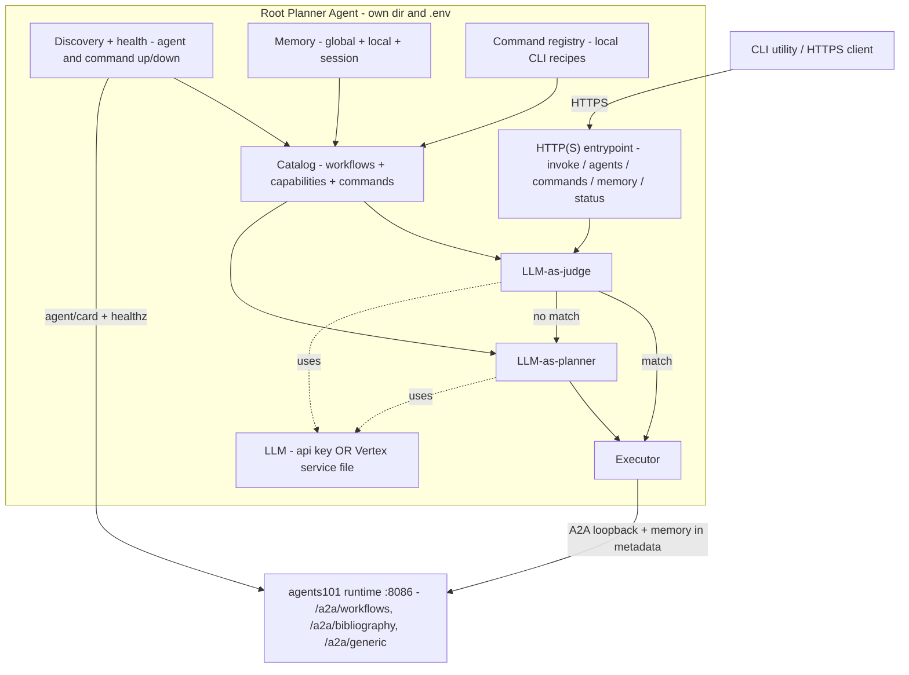
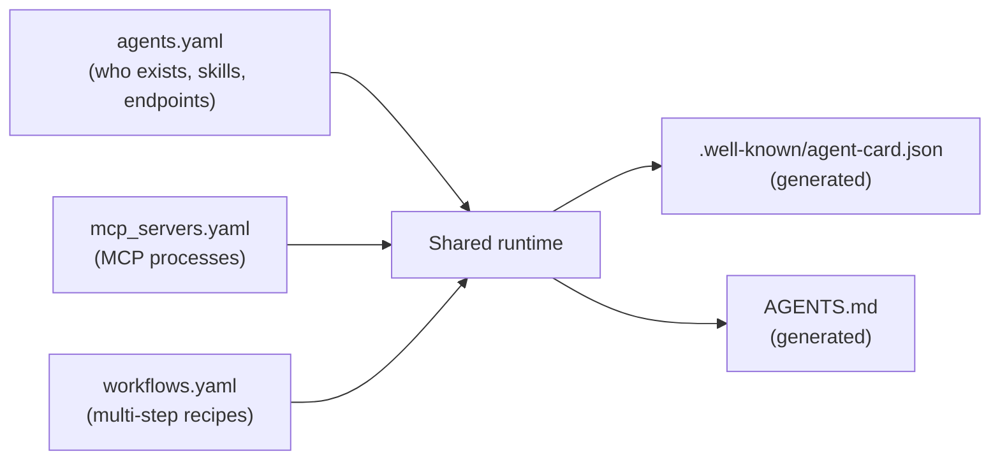
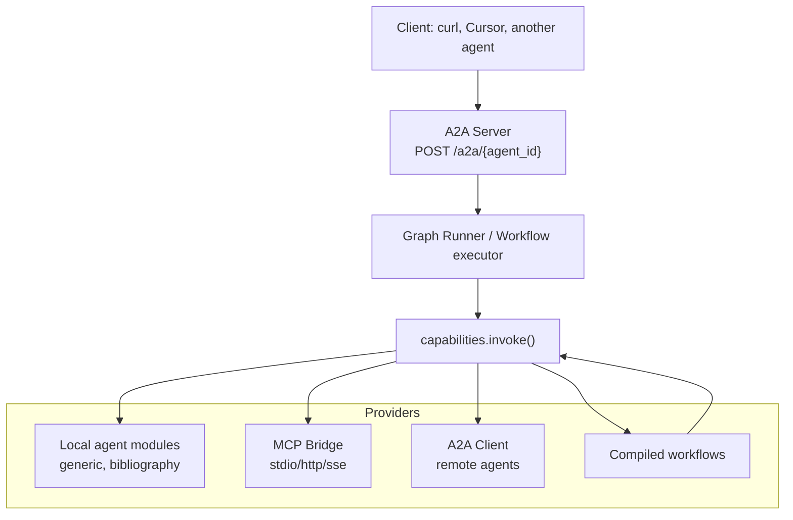
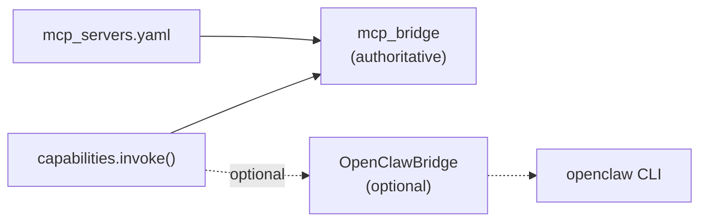
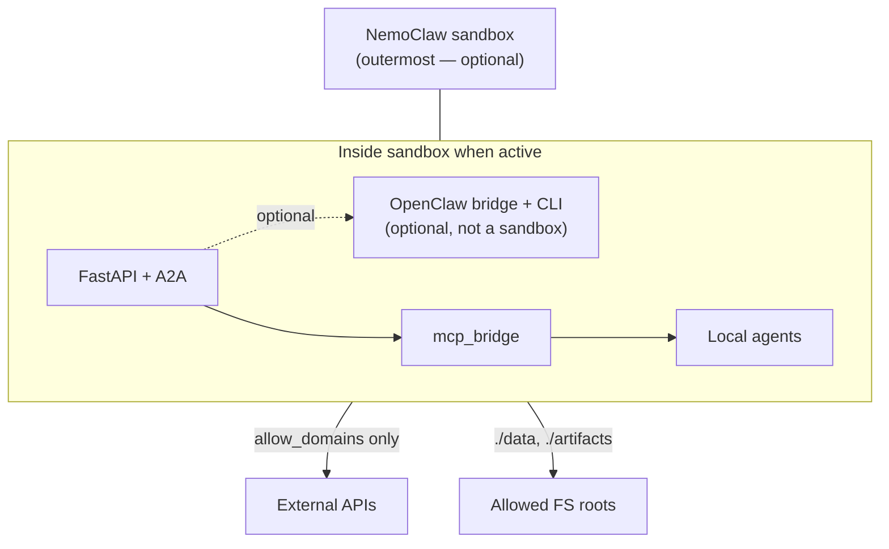

# How It All Fits Together

A mental model for the **agents101** local agent stack: how the root planner agent, A2A, MCP, local agents, workflows, OpenClaw, and NemoClaw relate to each other.

For layer-by-layer detail, see [architecture/00-overview.md](architecture/00-overview.md). For implementation phases, see [build-plan.md](build-plan.md). For the planner entrypoint, see [../root-agent/README.md](../root-agent/README.md).

## One sentence

A **root planner agent** is the entrypoint: it takes an HTTP(S) request, uses an LLM to **pick an existing workflow** or **synthesize a new plan**, enriches it with **memory**, and delegates to the **agents101 runtime** over **A2A**. That runtime exposes everything through A2A and routes all work through a single **`capabilities.invoke()`** seam over **local agents**, **MCP tools**, **workflows**, and **remote agents**. **OpenClaw** (optional operator shell) and **NemoClaw** (optional outer sandbox) sit outside the hot path — with NemoClaw outermost when enabled.

## The root planner agent (entrypoint)

The root agent is a **separate process** (own directory, own `.env`) that fronts the runtime. All other agents are reached over A2A, so it is decoupled from how they are implemented. See [../root-agent/README.md](../root-agent/README.md).



**Decision flow:**

1. **LLM-as-judge** reads the catalog of existing workflows (id + description) and decides whether one already satisfies the request (with a guardrail that rejects unknown workflow ids).
2. If none fits, **LLM-as-planner** reads the discovered agent capabilities + available local commands and synthesizes a plan whose steps are constrained to real capability URIs (`agent.* | mcp.* | command.*`).
3. The **executor** runs the chosen workflow (over `/a2a/workflows`) or the synthesized plan step by step, dispatching `agent.*` over A2A, `mcp.*` via the root's MCP, and `command.*` via guarded local execution.

**LLM providers** are pluggable by env: `openai | anthropic | gemini` (API key) or `vertex` (Gemini via a service-account file, `GOOGLE_APPLICATION_CREDENTIALS` + `VERTEX_PROJECT`).

**Query what it sees:** `GET /agents` (and the CLI `root-agent agents`) reports which downstream agents are visible and up/down; `GET /commands` reports which local command recipes are available.

### Memory (Claude-style global + local)

The root agent layers three memory tiers and injects the relevant slice into every request:

| Tier | Scope | Default location |
|------|-------|------------------|
| **Global** | user-level, all sessions | `~/.root-agent/memory/GLOBAL.md` |
| **Local** | project / working dir | `./.root-agent/memory/LOCAL.md` |
| **Session** | one conversation (ephemeral) | in process, keyed by `conversation_id` |

A retriever builds a budget-bounded `MemoryContext` (most-specific tier first; keyword-ranked when over budget). It flows into the judge/planner prompts **and into the workflow**: for fixed workflows it rides along as `metadata.memory_context` (no input-schema changes); for synthesized plans the planner can template `{{ memory }}` into step inputs.

### Global commands (local CLI execution)

A registry of recipes describes **how to do a task with local command-line utilities**. Each recipe (`name`, `requires` binaries, typed `params`, an argv-array template, `timeout`, `safety`) becomes a guarded `command.<name>` capability the planner can pick. Execution never uses a shell — args are an argv array built from validated params — and is gated by binary allowlist, deny patterns, timeouts, and output limits. Unavailable recipes (missing binaries) are shown as down and excluded from planning. Run the whole stack under NemoClaw to add an OS-level boundary around these commands.

## Layer stack (outside → in)

When everything is enabled, the nesting looks like this:

```text
┌─────────────────────────────────────────────────────────┐
│  NemoClaw          optional outer sandbox               │
│  ┌───────────────────────────────────────────────────┐  │
│  │  agents101 runtime   core (always when running)   │  │
│  │  A2A · capabilities · workflows · mcp_bridge      │  │
│  │  ┌─────────────────────────────────────────────┐  │  │
│  │  │  OpenClaw        optional operator shell    │  │  │
│  │  │  CLI / MCP view via OpenClawBridge          │  │  │
│  │  └─────────────────────────────────────────────┘  │  │
│  └───────────────────────────────────────────────────┘  │
└─────────────────────────────────────────────────────────┘
         ▲                              ▲
         │                              │
    containment                   management UI
    (OS-level box)                (not a sandbox)
```

| Layer | What it is | Required? |
|-------|------------|-----------|
| **agents101 runtime** | FastAPI, A2A, capability registry, workflows, MCP bridge, local agents | Yes (this repo) |
| **OpenClaw** | Operator shell — manage agents/MCP from a CLI; bridge is optional | No |
| **NemoClaw** | Outermost sandbox — wraps the runtime (and OpenClaw when on) in OpenShell | No |

**OpenClaw is not a sandbox.** **NemoClaw is the sandbox.** When NemoClaw is on, OpenClaw runs inside it, not beside it.

### How you run it

| Mode | Command | What you get |
|------|---------|--------------|
| **Dev (default)** | `uv run uvicorn agent_stack.main:app --host 127.0.0.1 --port 8086` | Runtime only; no sandbox, no OpenClaw |
| **+ OpenClaw** | Same server + `OPENCLAW_ENABLED=true` | Operator bridge active; still no outer sandbox |
| **+ NemoClaw** | `bash scripts/run_in_nemoclaw.sh` (once launch line verified) | Whole stack inside OpenShell; OpenClaw optional inside |

Software policy (`allow_domains`, `allowed_roots` in `agents.yaml`) applies in all modes. NemoClaw adds a **harder OS-level** boundary on top when enabled.

## The capability model (the center)

Everything callable is a **capability URI**:

| URI pattern | What it is |
|-------------|------------|
| `mcp.<server>.<tool>` | MCP tool (filesystem, fetch, etc.) |
| `agent.<agent_id>.<skill>` | Local or remote agent skill |
| `workflow.<workflow_id>` | Declarative multi-step workflow |
| `builtin.<name>` | Control flow (`branch`, `parallel`, `human_approval`, …) |

There is **one** invocation function — `capabilities.invoke(uri, inputs, ctx)` — and that is where auth, policy, audit, tracing, and retries live. Workflows, agent graphs, and MCP calls all go through it.

The orchestrator is not a separate service. It is the **capability registry + graph runner + workflow compiler** working together.

## Three YAML files define the world



| File | Role |
|------|------|
| [`agents.yaml`](../agents.yaml.example) | Registry of agents (local Python modules or remote A2A endpoints), skills, auth, policy |
| [`mcp_servers.yaml`](../mcp_servers.yaml.example) | Which MCP servers to spawn or connect to |
| [`workflows.yaml`](../workflows.yaml.example) | Declarative DAGs that chain capabilities together |

Copy the `*.example` files to private gitignored names (`agents.yaml`, etc.) and edit freely. Regenerate artifacts with `uv run python scripts/generate_agent_artifacts.py`.

## Layer cake (how a request flows)



| Layer | Lives in | Role |
|-------|----------|------|
| **A2A Server** | `runtime/a2a_server.py` | HTTP edge: JSON-RPC `message/send`, `skills/list`, agent cards |
| **Graph Runner** | `runtime/graph_runner.py` | Runs local agent LangGraphs and dispatches to capabilities |
| **Workflow engine** | `runtime/workflows/` | Runs YAML-defined steps (agent → MCP → approve → parallel download) |
| **Capability registry** | `runtime/capabilities.py` | URI resolution, policy, audit, tracing |
| **Providers** | MCP bridge, A2A client, `agents/*` | Actually do the work |

At startup, `main.py` wires these pieces together:

```python
registry = CapabilityRegistry(config)
mcp = McpBridge()
a2a_client = A2AClient(config)
runner = GraphRunner(config, registry, mcp, a2a_client)
app.state.openclaw = OpenClawBridge(settings)
app.include_router(create_a2a_router(app))
```

## A2A: the wire protocol (in + out)

**A2A is the external face** of the stack — how clients and other agents talk to this runtime.

### Inbound (this runtime serves)

| Endpoint | Purpose |
|----------|---------|
| `GET /.well-known/agent-card.json` | Discovery (all local agents + synthetic `workflows` agent) |
| `POST /a2a/generic` | Generic echo agent |
| `POST /a2a/bibliography` | Bibliography agent skills |
| `POST /a2a/workflows` | Exposed workflows as skills (e.g. `bibliography-research`) |

Example:

```bash
curl -s -X POST http://127.0.0.1:8086/a2a/workflows \
  -H 'Content-Type: application/json' \
  -d '{
    "jsonrpc": "2.0",
    "id": "1",
    "method": "message/send",
    "params": {
      "skill": "bibliography-research",
      "inputs": { "pdf_path": "./data/paper.pdf" }
    }
  }'
```

### Outbound (this runtime calls others)

Agents with `runtime.kind: remote` in `agents.yaml` become capabilities like `agent.external_researcher.literature-search`. Workflows and local agents can call them; the **A2A client** handles timeouts, retries, and circuit breaking.

A2A is therefore both:

- **Server** — "here are my agents/workflows; invoke them"
- **Client** — "call that remote agent over the network"

See [architecture/05-a2a.md](architecture/05-a2a.md) for the full contract.

## MCP: tools as capabilities

MCP servers are **out-of-process tool providers**. The MCP bridge (`runtime/mcp_bridge.py`):

1. Starts or connects servers from `mcp_servers.yaml` (stdio, HTTP, SSE)
2. Discovers tools via `tools/list`
3. Registers each as `mcp.<server>.<tool>`

Workflows and agents never talk to MCP directly. They call `capabilities.invoke("mcp.filesystem-safe.download_url", ...)`.

See [architecture/04-mcp-integration.md](architecture/04-mcp-integration.md).

## Local agents: domain logic only

Each local agent is a small Python module with LangGraph state and graph:

| Agent | Endpoint | Role |
|-------|----------|------|
| `generic_agent` | `/a2a/generic` | Echo/debug fallback |
| `bibliography_agent` | `/a2a/bibliography` | Extract bibliography, resolve OA PDFs, summarize |

They are registered in `agents.yaml` with `runtime.kind: local` and a module path such as `agent_stack.agents.bibliography_agent.graph`. The shared runtime loads them dynamically. They do **not** embed their own A2A server or MCP lifecycle.

Direct skill call path:

```text
Client → A2A → GraphRunner → agent.bibliography.extract-bibliography → local handler
```

## Workflows: the multi-step orchestrator

Workflows are the main **orchestration** mechanism. A workflow in `workflows.yaml` is a sequence of steps, each calling a capability:

```yaml
- call: agent.bibliography.extract-bibliography
- call: agent.bibliography.resolve-open-access-pdfs
- type: human_approval
- type: parallel
  call: mcp.filesystem-safe.download_url
```

The compiler turns this into LangGraph. Workflows with `exposed_as_skill` appear on the synthetic **`/a2a/workflows`** endpoint — externally they look like another agent skill, but internally they coordinate agents, MCP, and approvals.

Multi-agent orchestration here means: **workflows compose capabilities**, and capabilities can be local agents, remote A2A agents, MCP tools, or nested workflows.

See [architecture/03-workflows.md](architecture/03-workflows.md).

## OpenClaw and NemoClaw: optional layers, not the core

Both are disabled by default and not required for v0.1. They are **not peers**:

- **NemoClaw** = outermost boundary (sandbox)
- **OpenClaw** = operator shell inside the runtime (and inside NemoClaw when both are on)

The nested box from [Layer stack](#layer-stack-outside--in) is the canonical picture. Below is how each layer behaves inside the runtime.

### OpenClaw — operator shell (inside NemoClaw when sandbox is on)

- **Role:** local agent shell, MCP management, operator UI in front of installed agents
- **Bridge:** `runtime/openclaw_bridge.py` — thin CLI adapter when `OPENCLAW_ENABLED=true`
- **Today:** disabled by default; real CLI integration is stubbed until verified locally
- **Not sandboxed by itself** — it is a management layer. NemoClaw provides the sandbox around it (and the rest of the runtime) when enabled
- **Important:** this repo's **`mcp_bridge` + `mcp_servers.yaml` are authoritative** for MCP. OpenClaw's MCP list is informational only when enabled



See [architecture/09-openclaw.md](architecture/09-openclaw.md).

### NemoClaw — outer sandbox (wraps runtime + OpenClaw)

- **Role:** outer containment layer — runs the FastAPI server, MCP subprocesses, and OpenClaw bridge/CLI inside OpenShell
- **Wrapper:** `scripts/run_in_nemoclaw.sh` — v0.1 checks CLI presence and prints help; does not launch uvicorn in a sandbox yet
- **Without NemoClaw** (normal dev): `uv run uvicorn agent_stack.main:app --host 127.0.0.1 --port 8086` — no outer box; OpenClaw optional on its own
- Runtime policy in `agents.yaml` (`allow_domains`, `allowed_roots`) is enforced **in software** regardless; NemoClaw adds a **harder OS-level** boundary around the whole stack when wired up



See [architecture/10-nemoclaw.md](architecture/10-nemoclaw.md).

## Full picture

End-to-end view: clients hit the root planner agent; it delegates over A2A to the runtime, where orchestration goes through `capabilities.invoke()`; optional layers wrap the bottom.

```text
  Clients (CLI utility, curl, other A2A agents)
                    │
                    │  HTTP(S) /invoke
                    ▼
  Root Planner Agent (own dir/.env): judge → workflow|plan,
  memory (global/local/session), command.* recipes, own MCP
                    │
                    │  A2A loopback (memory in metadata)
                    ▼
┌───────────────────────────────────────────────────────────────┐
│ NemoClaw sandbox (optional — outermost)                       │
│ ┌───────────────────────────────────────────────────────────┐ │
│ │ FastAPI A2A Server  :8086                                  │ │
│ │   /.well-known/agent-card.json                             │ │
│ │   /a2a/generic | /bibliography | /workflows                │ │
│ │                           │                                │ │
│ │     ┌─────────────────────┼─────────────────────┐          │ │
│ │     ▼                     ▼                     ▼          │ │
│ │  Agent graphs      Workflow compiler    OpenClaw bridge    │ │
│ │  (LangGraph)       (YAML → LangGraph)   (optional)         │ │
│ │     └─────────────────────┬─────────────────────┘          │ │
│ │                           ▼                                │ │
│ │              capabilities.invoke()  ← orchestration seam   │ │
│ │                           │                                │ │
│ │     ┌──────────┬──────────┼──────────┬──────────┐          │ │
│ │     ▼          ▼          ▼          ▼          ▼          │ │
│ │  Local      MCP       A2A        Built-ins   Workflows     │ │
│ │  agents     bridge    client                 (nested)      │ │
│ └───────────────────────────────────────────────────────────┘ │
└───────────────────────────────────────────────────────────────┘
```

Without NemoClaw, the inner box is what you run directly via uvicorn.

## Three concentric rings

1. **Inner ring (always on)** — YAML config → capability registry → providers (local agents, MCP, remote A2A)
2. **Middle ring (orchestration)** — workflows and LangGraph coordinate multi-step jobs through the same capability URIs
3. **Outer rings (optional, nested)** — OpenClaw operator shell inside the runtime; **NemoClaw sandbox outside the entire runtime** (including OpenClaw) when enabled

## What is implemented today

| Piece | Status | Layer |
|-------|--------|-------|
| Root planner agent (judge + planner, HTTP/CLI) | Implemented in `root-agent/` | Entrypoint (own process) |
| Memory (global + local + session) | Implemented | Root agent |
| Global commands (local CLI recipes) | Implemented | Root agent |
| LLM providers (openai/anthropic/gemini/vertex) | Implemented (SDKs optional) | Root agent |
| A2A server + agent cards | Core | Runtime |
| Local agents (generic, bibliography) | Core | Runtime |
| MCP bridge + `mcp_servers.yaml` | Core | Runtime |
| Workflows as A2A skills | Core | Runtime |
| Remote A2A client | Core | Runtime |
| OpenClaw bridge | Stub; off by default | Inside runtime (inside NemoClaw when sandbox on) |
| NemoClaw wrapper | Doc + help script; no sandbox launch yet | Outermost sandbox |
| Cursor / other IDEs | Client only (read `AGENTS.md`, call A2A) | Outside stack |

## Where to read next

| Topic | Doc |
|-------|-----|
| Root planner agent (entrypoint) | [../root-agent/README.md](../root-agent/README.md) |
| Layer cake and request lifecycles | [architecture/00-overview.md](architecture/00-overview.md) |
| The three YAML registries | [architecture/01-config-and-registries.md](architecture/01-config-and-registries.md) |
| Capability URIs and errors | [architecture/02-capabilities.md](architecture/02-capabilities.md) |
| Workflow YAML grammar | [architecture/03-workflows.md](architecture/03-workflows.md) |
| OpenClaw operator shell | [architecture/09-openclaw.md](architecture/09-openclaw.md) |
| NemoClaw outer sandbox | [architecture/10-nemoclaw.md](architecture/10-nemoclaw.md) |
| Add agents, MCP servers, workflows | [architecture/12-extension-cookbook.md](architecture/12-extension-cookbook.md) |
| Phased build plan | [build-plan.md](build-plan.md) |
